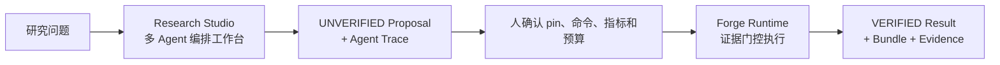
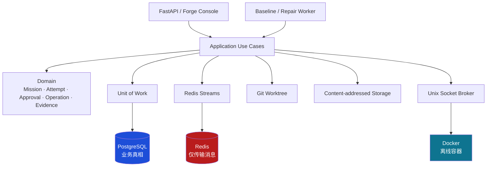

# Research Forge：把研究想法变成可复现实验

> **Research Studio 负责多 Agent 探索，Forge Runtime 负责证据验证。**
>
> 这个项目不是“让 AI 自动宣布科研成功”，而是把论文、代码版本、运行命令和指标固定下来，产出可审计、可重放的实验结论。

[探索 Research Studio](docs/studio/README.md) · [查看 Forge Runtime](docs/product/overview.md) · [产品流程](docs/product/studio-forge-workflow.md) · [部署手册](docs/operations/deployment.md)

<p align="center">
  <a href="https://github.com/chasen2041maker/research-forge/actions/workflows/research-forge.yml"></a>
  
  
  
</p>

## 两个产品，一条清晰边界

| 产品 | 它做什么 | 真实输出 | 不能宣称什么 |
| --- | --- | --- | --- |
| **Research Studio** | 动态专家路由、并行评审、多源检索、人机澄清、多路线研究和代码修复建议 | `UNVERIFIED` 的研究提案与可追踪 Agent 运行记录 | 已验证科研结论、自动确认执行参数、生产级自主科研系统 |
| **Forge Runtime** | 冻结 Spec、运行受限实验、提取指标、闭合证据、封存 Bundle | `VERIFIED` 的 `VerifiedResult v1` | 自动采信 Studio 建议，或把运行中状态当成结论 |



Studio 的能力证明、事件类型、三套可复现演示与限制见 [Research Studio Capability Guide](docs/studio/README.md)。

## Forge：先用一句话理解

给 Forge 一份**冻结的实验规格**：论文文件、Git commit、Docker 镜像 digest、运行命令、指标和预算。Forge 只有在以下内容全部对得上时，才会输出 `VERIFIED`：

- 代码确实来自指定 commit；
- 容器按离线、安全限制运行；
- 指标来自指定的产物路径和 JSON 指针；
- 指标满足冻结的判断条件；
- 产物、日志、证据链和 Bundle 均已登记并校验。

## 我应该从哪里开始？

| 你的目标 | 从这里开始 | 得到什么 |
| --- | --- | --- |
| 想研究一个问题、查文献、形成假设 | [Research Studio](frontend/src/app/studio/page.tsx) | `UNVERIFIED` 的 `ResearchProposal v1` |
| 已经有论文、代码、commit 和评测命令 | [Forge Console](frontend/src/app/forge/page.tsx) | 一个可追踪的 Forge Mission |
| 想验证整个产品链路 | [三条演示](docs/operations/product-demos.md) | 交接、验证回传、修复审批的 JSON 报告 |
| 想在服务器部署 | [部署手册](docs/operations/deployment.md) | PostgreSQL、Redis、broker 和服务进程配置 |

## 这两个系统如何连接？

```mermaid
flowchart LR
    U[研究者] --> S[Research Studio<br/>探索、文献、假设]
    S -->|ResearchProposal v1<br/>UNVERIFIED| H[人工确认
论文 hash / commit / 镜像 / 命令 / 指标 / 预算]
    H -->|POST /v1/proposals/handoff| F[Research Forge]

    subgraph F[Research Forge：证据门控验证]
        M[冻结 ReproductionSpec] --> P[前置校验
论文 / Git / 镜像]
        P --> W[Mission / Task / Attempt]
        W --> B[离线 Sandbox Broker]
        B --> E[指标、Claim、Evidence]
        E --> Z[可重放 Bundle]
    end

    Z -->|GET /v1/missions/:id/verified-result| R[VerifiedResult v1<br/>只读事实]
    R --> S

    style S fill:#5b21b6,color:#fff
    style F fill:#0e7490,color:#fff
    style R fill:#047857,color:#fff
```



关键原则：**Studio 的建议不会自动变成执行参数；人必须确认每一个 pin 和预算。** Forge 完成证据闭环后，才会回传只读的 `VerifiedResult v1`。

## Forge 内部架构



### 哪些组件负责什么？

| 组件 | 职责 | 不负责什么 |
| --- | --- | --- |
| PostgreSQL | Mission、审批、租约、操作账本和证据的业务真相 | 运行容器、保存大文件字节 |
| Redis Streams | baseline/repair 两条队列、确认、超时接管、死信队列 | 决定 Mission 是否成功 |
| CAS | 以 SHA-256 保存日志、指标、补丁和 Bundle | 修改已保存的产物 |
| Docker broker | 唯一能调用 Docker 的进程 | 业务决策、数据库写入 |
| DecisionEngine | 基于已验证日志、路径和预算提出一个 diff | Git、Docker、数据库、Redis、CAS 或密钥访问 |

## 三条核心流程

### 1. 基线复现

```text
冻结 Spec → 校验论文/Git/镜像 → 创建 Mission → 离线运行
→ 提取指标 → 生成 Evidence → 封存 Bundle → VERIFIED
```

### 2. Studio → Forge 交接

```text
Studio Proposal（未验证）
        ↓
人工补齐并确认所有执行字段
        ↓
Forge 复用普通 Mission 创建流程
        ↓
完成后才能读取 VerifiedResult
```

### 3. 受限修复

```text
基线失败 → DecisionEngine 生成一个 unified diff
→ diff 写入 CAS → 人工审批该精确字节 hash
→ 新 Attempt 读取已批准 diff → 一次候选提交、一次候选运行
→ 指标与证据闭环
```

审批后不会重新让模型生成补丁；候选执行只读取审批绑定的 CAS 补丁字节。

## 5 分钟本地验证

### 1. 安装后端依赖并跑测试

```powershell
python -m pip install -r deploy/research-forge/requirements.txt httpx mypy pytest ruff
python -m pytest backend/tests/research_forge backend/tests/research_integration -q -m "not docker"
python -m mypy backend/research_forge backend/research_contracts backend/research_gateway backend/co_scientist/public_api --follow-imports=skip --ignore-missing-imports --check-untyped-defs --warn-unused-ignores
```

### 2. 跑三条产品演示

```powershell
python backend/scripts/run_research_forge_demos.py --output-dir artifacts/demo-reports
```

输出 JSON 会记录三条演示是否成功：Studio 交接、VerifiedResult 回传、修复审批闭环。

### 3. 检查前端类型

```powershell
cd frontend
npm install
npm exec -- tsc --noEmit
```

完整 Linux Docker 验证和正式部署请看 [部署手册](docs/operations/deployment.md)。Windows 原生适合开发和 UI；正式沙箱验收环境是 Linux/WSL2。

## 已实现与暂不承诺

| 已实现 | 暂不承诺 |
| --- | --- |
| 版本化 Spec、Studio Proposal、VerifiedResult 合同 | 通用远程 Git URL 自动拉取 |
| PostgreSQL 业务真相、乐观锁、租约和取消 | 生产环境已配置的 LLM 提供商 |
| Redis Streams、超时接管、死信队列 | 多候选自动搜索或自动发 PR |
| broker 重启后的已完成结果恢复 | 外部论文基准上的统计学结论 |
| 补丁 CAS 持久化与 hash 审批绑定 | Windows 原生正式 Docker 安全验收 |
| Bundle、指标、证据和 VerifiedResult 回传 | 让 Studio 自动替用户确认执行参数 |

## 常用接口

| 接口 | 用途 |
| --- | --- |
| `GET /api/research/{fork_id}/proposal` | Studio 导出未验证 Proposal |
| `POST /v1/proposals/handoff` | 提交 Proposal 和人工确认的执行字段 |
| `GET /v1/missions/{mission_id}` | 读取 Mission、Task、Attempt 和审批状态 |
| `POST /v1/approvals/{approval_id}/decide` | 批准或拒绝高风险修复补丁 |
| `GET /v1/missions/{mission_id}/bundle` | 下载可重放 Bundle |
| `GET /v1/missions/{mission_id}/verified-result` | 读取已完成 handoff Mission 的 VerifiedResult |

除 Studio 的本地导出接口外，Forge API 使用本地 Bearer Token；接口细节见 [产品流程](docs/product/studio-forge-workflow.md)。

## 项目目录

```text
backend/
  co_scientist/          Research Studio（探索）
  research_contracts/    两个产品共享的 JSON 合同
  research_gateway/      Studio → Forge 编译与边界
  research_forge/        Forge 领域、用例、适配器和启动配置
  scripts/               演示与冻结评估脚本
frontend/src/app/
  studio/                Studio 页面
  forge/                 Forge 控制台
docs/
  product/               产品流程
  architecture/          架构与实现状态
  operations/            部署、恢复、演示
  contracts/             ReproductionSpec / Proposal / VerifiedResult
```

## 深入阅读

- [产品总览](docs/product/overview.md)
- [ReproductionSpec v1](docs/contracts/reproduction-spec-v1.md)
- [VerifiedResult v1](docs/contracts/verified-result-v1.md)
- [实现状态矩阵](docs/architecture/implementation-status.yaml)
- [部署与恢复](docs/operations/deployment.md)
- [三条产品演示](docs/operations/product-demos.md)

## English summary

Research Forge turns a fully pinned experiment (paper artifact, Git commit, image digest, command,
metric, and budgets) into evidence-gated, replayable results. Research Studio explores and emits
an `UNVERIFIED` proposal; a human confirms all execution facts before Forge runs it. Forge returns
`VerifiedResult v1` only after its Mission, metric, claims, evidence, and Bundle have all closed.

## License

[Apache License 2.0](LICENSE)
