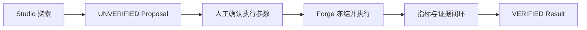

# Research Forge 中文阅读入口

项目主 README 已切换为中文优先，请直接阅读 [README.md](README.md)。

它包含：

1. 这个项目解决什么问题；
2. Studio 与 Forge 的边界和交接图；
3. Forge 的运行架构图；
4. 基线复现、人工审批修复、VerifiedResult 回传三条流程；
5. 本地验证、部署、API 与限制说明。

快速入口：

- [产品流程](docs/product/studio-forge-workflow.md)
- [三条产品演示](docs/operations/product-demos.md)
- [部署手册](docs/operations/deployment.md)
- [架构决策](docs/adr/README.md)

## 最短说明

Research Studio 用来探索，输出永远是 `UNVERIFIED` 的研究建议；Research Forge 用来验证，只有论文、commit、镜像、命令、指标、证据和 Bundle 全部闭环后，才会输出 `VERIFIED` 的 `VerifiedResult v1`。

[English summary](README.md#english-summary)
