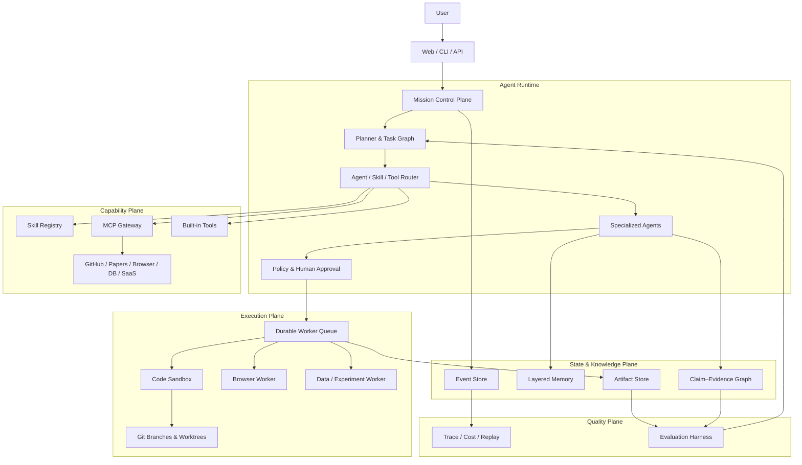
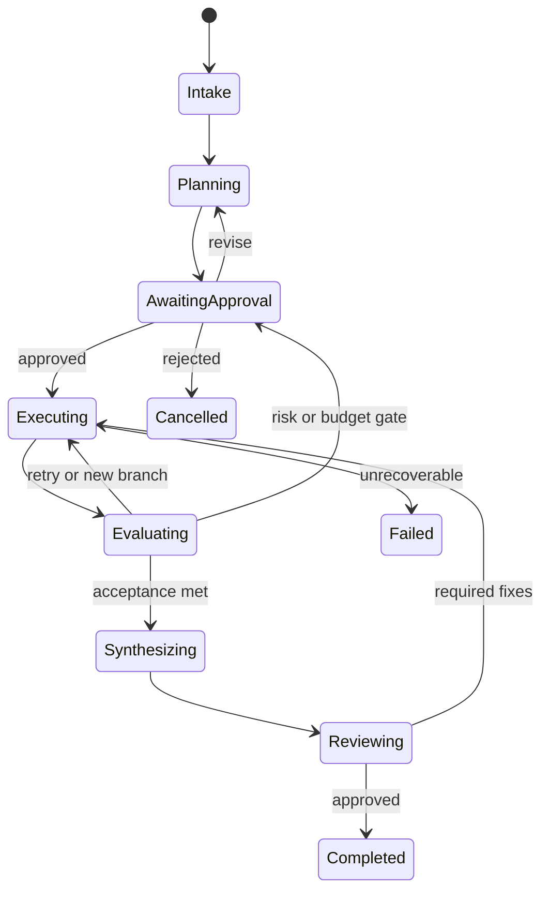

# Research Forge 2.0：大型综合 Agent 能力平台设计蓝图

> 文档状态：Draft for Architecture Review  
> 仓库：`chasen2041maker/research-forge`  
> 目标版本：`v1.0`  
> 调研日期：2026-07-12  
> 项目定位：Agent Engineering Showcase + Autonomous Research Engineering

---

## 0. 一句话结论

Research Forge 2.0 不再只是“从问题到论文的固定科研流水线”，而是一个以科研工程为旗舰场景、同时展示长任务编排、多 Agent、Skills、MCP、记忆、Git 工作区、沙箱、浏览器、评测与可观测性的综合 Agent 工程平台。

推荐宣传语：

> **Research Forge — An extensible, evidence-native Agent OS for research, coding and long-horizon knowledge work.**

中文版本：

> **一个可扩展、证据原生、面向科研与复杂知识工作的 Agent 操作系统。**

项目最终需要证明的不是“接入了多少 API”，而是以下五件事：

1. Agent 能把模糊目标拆成可验证的长任务并持续执行。
2. Agent 能按需发现、加载、组合和评测 Skills。
3. Agent 能通过 MCP 安全访问真实外部系统。
4. Agent 的代码、实验、浏览器操作和决策均可审计、回放和人工接管。
5. Agent 能使用结果反馈改进下一步，而不是一次生成后结束。

---

## 1. 为什么要重新设计

当前项目已经具备 M0–M8、LangGraph、文献检索、多 Reviewer、实验设计、Docker 沙箱、论文生成、多分支和前端等能力，但中心模型仍然是固定 DAG：

```text
问题 → 检索 → Gap → 评审 → 实验方案 → 代码 → 论文
```

它适合教学和功能演示，但不足以展示现代 Agent 工程的关键难题：

- 长时间运行与断点恢复；
- 动态规划和根据结果改变路线；
- 多 Agent 的上下文隔离与委派；
- Skills 的渐进加载、版本、依赖和评测；
- MCP 服务发现、权限、安全和可观测；
- 真实 Git 分支、worktree 与代码演化；
- 浏览器、终端、数据、代码执行等多种环境；
- 人工审批和高风险操作控制；
- 结果证据链与端到端质量评测。

因此本次不是继续添加 M9、M10，而是把已有模块提升为可组合的能力平台。

---

## 2. GitHub 同类项目调研

以下内容只借鉴公开设计思想。实现时必须检查各项目许可证，禁止直接复制不兼容代码、品牌素材或受限制内容。

### 2.1 代表项目与值得吸收的能力

| 项目 | 值得吸收的设计 | Research Forge 的落地方式 |
|---|---|---|
| [DeerFlow](https://github.com/bytedance/deer-flow) | Super Agent Harness、渐进加载 Skills、子 Agent、记忆、沙箱、Gateway | 构建统一 Runtime；只向 Agent 暴露当前任务相关能力 |
| [Agent Zero](https://github.com/agent0ai/agent-zero) | 完整 Linux 环境、项目隔离、Plugin Hub、Skills、MCP、A2A、实时 UI | 每个 Mission 独立工作区；插件中心；实时终端/浏览器画面 |
| [Letta](https://github.com/letta-ai/letta) / [Letta Code](https://github.com/letta-ai/letta-code) | Memory-first、长期身份、记忆块、自我改进 | 明确区分工作、情节、语义、程序和用户记忆；支持人工编辑 |
| [DeepScientist](https://github.com/ResearAI/DeepScientist) | 一个研究任务一个 Git 仓库、worktree、失败经验保留、人工接管 | Mission 使用真实 Git branch/worktree；失败路线也是资产 |
| [AI Scientist v2](https://github.com/SakanaAI/AI-Scientist-v2) | Experiment Manager、Best-first Tree Search、并行探索与失败调试 | Hypothesis Portfolio + 并行实验树 + 预算约束搜索 |
| [RD-Agent](https://github.com/microsoft/RD-Agent) | Research/Development 双循环、真实执行、公开 benchmark 成绩 | Planner 提案、Executor 实现、Evaluator 用真实指标反馈 |
| [STORM](https://github.com/stanford-oval/storm) | 多视角检索、引用报告、人机协作知识整理 | Claim–Evidence Graph；报告只能消费已验证证据 |
| [Open Coscientist](https://github.com/jataware/open-coscientist) | LangGraph、多角色假设生成、排名和进化 | 保留现有 LangGraph 优势，将固定节点改为能力图 |
| [Microsoft APM](https://github.com/microsoft/apm) | Agent 依赖清单、锁文件、跨客户端可移植、安全扫描 | `forge.yaml` + `forge.lock` 管理 Skills/MCP/Agent 依赖 |
| [Microsoft Skills](https://github.com/microsoft/skills) | Skills 分类、选择性加载、测试 Harness、Agent/Prompt/MCP 配套 | Skill 必须带测试、权限、兼容性；禁止一次加载全部 Skills |
| [Memento Skills](https://github.com/Memento-Teams/Memento-Skills) | Skill 路由、执行后反思、成功强化、失败优化、统一 Tool Registry | Skill 使用记录、效果评分、候选改进，但自动修改必须送审 |
| [MCP Registry](https://github.com/modelcontextprotocol/registry) | MCP 服务目录、发布验证、服务发现 | 实现 MCP Catalog Adapter，不自造封闭协议 |
| [GitHub MCP Server](https://github.com/github/github-mcp-server) | 真实仓库、Issue、PR、Workflow 操作 | 把“代码任务 → 分支 → PR → CI”作为旗舰 Demo |
| [Browser Use](https://github.com/browser-use/browser-use) | 持久浏览器、恢复循环、真实网页任务、公开 benchmark | Browser Worker + 可视回放 + 域名和动作权限策略 |
| [OpenAI Agents SDK](https://github.com/openai/openai-agents-python) | Handoff、Guardrails、Tracing、MCP 等清晰原语 | 借鉴原语边界；平台内部保持 Provider/Runtime 可替换 |
| [PaperBench](https://github.com/openai/preparedness/tree/main/project/paperbench) | 论文复现、独立执行和评分容器、细粒度 Rubric | 科研旗舰 Eval；先支持低成本 Code-Dev 子集 |
| [MLE-Bench](https://github.com/openai/mle-bench) | 真实 ML 工程任务、多次运行、资源披露、方差报告 | 数据/代码 Agent 的公开量化评测基线 |

### 2.2 不能简单照搬的内容

- 不复制 DeerFlow 或 Agent Zero 的整体产品外观，否则失去个人项目辨识度。
- 不宣称“全自动科学发现”而没有真实实验和公开评测。
- 不把 MCP 工具全部塞进系统提示词，避免上下文污染和错误调用。
- 不允许 Agent 不经审批安装和执行未知 Skills/MCP Server。
- 不把“LLM 给出的评分”当成唯一效果指标。
- 不使用数据库中的假 Fork 冒充真实 Git 分支。
- 不用功能数量代替可用性、稳定性和可复现性。

---

## 3. 产品定位

### 3.1 核心定位

Research Forge 是一个可本地部署的 Agent Engineering Workbench：

- 使用同一套 Runtime 执行科研、代码、浏览器和数据任务；
- 通过 Skills 提供可复用方法；
- 通过 MCP 连接外部世界；
- 通过 Git Workspace 和 Artifact Store 保存真实工作成果；
- 通过 Event Log、Trace 和 Eval 证明任务是如何完成的；
- 通过 Human Gate 保证高风险操作仍由人控制。

### 3.2 三个旗舰展示场景

#### 场景 A：Research Quest

输入一篇论文、一个代码仓库和一个研究目标，系统完成：

1. 理解论文贡献与实验设置；
2. 检查引用、数据集和代码可访问性；
3. 复现基线；
4. 生成多个可验证假设；
5. 创建独立 worktree 并行实验；
6. 比较指标、方差、成本和失败原因；
7. 形成 Claim–Evidence Graph；
8. 输出可复现 Research Bundle。

#### 场景 B：Issue-to-PR Coding Mission

输入 GitHub Issue，系统完成：

1. 读取仓库和贡献规范；
2. 制定计划并请求必要澄清；
3. 创建分支/worktree；
4. 修改代码并运行测试；
5. 浏览器验证 UI；
6. 生成变更说明；
7. 提交 PR；
8. 读取 CI 结果，失败则修复，最终等待人工合并。

#### 场景 C：Web + Data Investigation

输入一个需要联网和数据分析的问题，系统完成：

1. 多源搜索与浏览器交互；
2. 下载或提取结构化数据；
3. 保留来源与操作截图；
4. 在沙箱中分析数据并生成图表；
5. 对矛盾信息发起复核；
6. 输出可追溯报告和数据包。

三个场景共享同一套 Agent、Skill、MCP、Memory、Sandbox、Git、Trace 与 Eval 基础设施。

---

## 4. 设计原则

1. **Evidence before prose**：先有证据和真实产物，再生成叙述。
2. **Execution over simulation**：能运行测试或实验时，不用 LLM 猜测结果。
3. **Progressive disclosure**：Skills、工具说明和上下文按需加载。
4. **Least privilege**：每个 Agent、Skill、MCP 只获得完成任务所需的最小权限。
5. **Durable by default**：长任务必须可中断、恢复、重试和回放。
6. **Human authority**：外部写入、高成本、敏感数据和危险执行必须可审批。
7. **Git is the code truth**：代码路线使用真实 branch/worktree，而不是数据库模拟。
8. **Events are the process truth**：决策和操作以事件日志为事实来源。
9. **Artifacts are the result truth**：报告不能覆盖真实日志、指标和代码产物。
10. **Eval before self-improvement**：没有评测结果，Agent 不得自动强化 Skill。
11. **Provider independence**：模型、搜索、浏览器和 MCP 实现可替换。
12. **One strong story first**：优先完成一个端到端旗舰 Demo，再扩展更多场景。

---

## 5. 核心概念模型

### 5.1 Mission

用户希望系统完成的一项长期目标，是平台的最上层对象。

```text
Mission
├── objective
├── constraints
├── budget
├── workspace
├── plan
├── agents
├── tasks
├── artifacts
├── events
└── evaluation
```

科研场景中的 Mission 可命名为 Quest；二者底层结构一致。

### 5.2 Task

可执行、可观察、可验证的工作单元。Task 必须有：

- 输入和预期输出；
- 负责 Agent；
- 允许使用的 Skills 和 Tools；
- 前置依赖；
- 验收条件；
- 超时、预算和重试策略；
- 风险等级；
- 当前状态。

### 5.3 Agent Profile

Agent 不是简单角色 Prompt，而是一套可执行配置：

```yaml
name: experiment-manager
description: Selects and manages experiment branches.
model_policy: reasoning
skills:
  - hypothesis-ranking
  - experiment-design
mcp_servers:
  - github
  - papers
permissions:
  filesystem: workspace
  network: allowlisted
  shell: sandbox-only
handoffs:
  - evidence-agent
  - coding-agent
  - evaluator-agent
```

### 5.4 Skill

Skill 是“如何完成一类任务”的可复用程序性知识，不等于 API Tool。

Skill 可以包含：

- `SKILL.md`：触发条件、工作流、注意事项；
- `skill.yaml`：版本、依赖、权限、兼容性；
- `scripts/`：确定性脚本；
- `references/`：按需读取的知识；
- `assets/`：模板和静态资源；
- `evals/`：输入、期望行为和评分器。

### 5.5 Tool 与 MCP

Tool 是一次具体动作，如读取文件、搜索论文、创建 Issue。

MCP Server 是外部能力提供者，可以暴露：

- Tools；
- Resources；
- Prompts；
- Elicitation/交互能力；
- 外部系统上下文。

Skill 可以指导 Agent 如何组合多个 MCP Tools，但 Skill 本身不应保存密钥。

### 5.6 Artifact

任何可交付、可验证的结果：

- 代码、Git diff、Commit；
- 实验日志和指标；
- 浏览器截图；
- 数据集清单；
- 证据记录；
- 图表、报告、论文；
- PR、Issue、Release 链接。

### 5.7 Event

所有重要操作都写入不可变事件流：

```text
MissionCreated
PlanProposed
HumanApproved
SkillLoaded
McpToolCalled
BranchCreated
ExperimentStarted
ExperimentFailed
MetricObserved
ClaimVerified
TaskRetried
AgentHandedOff
ArtifactPublished
```

---

## 6. 总体架构



### 6.1 Control Plane

职责：

- 创建和管理 Mission；
- 维护任务依赖图；
- 控制状态转换；
- 调度 Agent 和 Worker；
- 管理预算、重试、暂停和审批；
- 向前端推送事件。

推荐继续使用 FastAPI + LangGraph，但进行职责拆分：

- FastAPI：外部接口和 WebSocket；
- LangGraph：计划、决策、Handoff 和动态路由；
- Celery/Redis 或独立 Worker：长时间执行、并行实验和浏览器任务；
- PostgreSQL：Mission、Task、Event、Policy、Metadata；
- LangGraph Postgres Checkpointer：可恢复 Agent 状态。

### 6.2 Capability Plane

统一管理：

- Agent Profiles；
- Skills；
- Built-in Tools；
- MCP Servers；
- Prompt/Policy；
- 版本和兼容性。

Router 根据任务意图、Agent 权限、历史成功率和成本选择最小能力集合。

### 6.3 Execution Plane

所有非纯推理工作进入 Worker：

- Code Worker：文件、Shell、测试、构建；
- Browser Worker：页面导航、点击、输入、截图；
- Research Worker：检索、PDF 解析、引用验证；
- Experiment Worker：训练、评估、指标收集；
- Document Worker：图表、报告、LaTeX/PDF。

执行默认发生在沙箱，而不是 API 进程。

### 6.4 State & Knowledge Plane

禁止用一个巨大 TypedDict 承载全部状态。拆分为：

- Transactional State：PostgreSQL；
- Durable Agent State：LangGraph Checkpoint；
- Code State：Git；
- Large Artifacts：Local/S3/MinIO；
- Semantic Retrieval：pgvector/Qdrant；
- Evidence Relationships：Postgres 图式表，必要时再接 Neo4j；
- Event History：Append-only Event Store。

---

## 7. Skill 系统设计

### 7.1 Skill 目录规范

```text
skills/
└── experiment-design/
    ├── SKILL.md
    ├── skill.yaml
    ├── scripts/
    │   └── validate_plan.py
    ├── references/
    │   └── reproducibility-checklist.md
    ├── assets/
    │   └── experiment-template.yaml
    └── evals/
        ├── cases.yaml
        └── rubric.yaml
```

### 7.2 Skill Manifest

```yaml
schema_version: 1
name: experiment-design
version: 0.1.0
description: Design reproducible ML experiments from a hypothesis.
triggers:
  - design an experiment
  - compare research hypotheses
inputs:
  required:
    - hypothesis
    - available_datasets
outputs:
  - experiment_spec
dependencies:
  skills:
    - evidence-validation>=0.1
  mcp:
    - papers
permissions:
  network: read-only
  filesystem: workspace
  shell: none
risk: medium
compatibility:
  agents:
    - research-planner
    - experiment-manager
evals:
  path: evals/cases.yaml
```

### 7.3 Skill 生命周期

```text
discover → inspect metadata → permission check → load instructions
→ execute → collect result → evaluate → record utility
→ propose improvement → human review → release new version
```

自动学习只能生成“候选 Skill 变更”，不得直接覆盖稳定版本。

### 7.4 Skill Router 评分

候选 Skill 评分应综合：

- 语义相关度；
- 输入输出匹配；
- 权限是否满足；
- 历史成功率；
- 成本和延迟；
- Agent 兼容性；
- 当前版本信任等级。

### 7.5 Skill Eval

每个重要 Skill 至少需要：

- 正常任务；
- 不应触发任务；
- 缺失输入；
- 工具失败；
- 权限拒绝；
- 注入攻击；
- 成本上限；
- 输出结构检查。

---

## 8. MCP Gateway 设计

### 8.1 为什么需要 Gateway

直接让每个 Agent 自行连接 MCP 会产生：

- 工具名冲突；
- Schema 重复占用上下文；
- 密钥散落；
- 缺少统一审批；
- Server 不可用拖垮任务；
- 无法追踪工具调用和成本；
- 恶意 MCP/提示注入风险。

因此所有 MCP 连接必须通过 Gateway。

### 8.2 Gateway 功能

- stdio、HTTP/Streamable HTTP 连接；
- Server 注册、健康检查与自动重连；
- Tool/Resource/Prompt 发现；
- Tool namespacing；
- Schema 缓存和按需暴露；
- OAuth/Token/Secret 引用；
- Agent/Skill 级 allowlist；
- 输入输出验证；
- 超时、重试、熔断和限流；
- 高风险工具审批；
- 完整审计事件；
- MCP Registry Adapter；
- Mock Server 与契约测试。

### 8.3 MCP 风险分级

| 等级 | 示例 | 默认策略 |
|---|---|---|
| R0 | 搜索公开文档 | 自动允许 |
| R1 | 读取用户仓库或文件 | 授权范围内允许 |
| R2 | 创建本地文件、运行无网络沙箱 | 首次提示，可记住授权 |
| R3 | 写 GitHub、发送消息、修改云资源 | 每类操作显式审批 |
| R4 | 删除、付款、生产发布、公开发送 | 每次审批 + 二次确认 |

### 8.4 首批 MCP 集成

核心：

- GitHub；
- Filesystem；
- Playwright/Browser；
- arXiv/OpenAlex/Semantic Scholar；
- PostgreSQL；
- Context7/官方文档；
- MarkItDown/PDF；
- Hugging Face。

第二阶段：

- Slack/Teams；
- Google Drive/Notion；
- Linear/Jira；
- Cloud/Deployment；
- 数据仓库和实验追踪平台。

---

## 9. Agent 团队

不建议创建十几个永远在线的角色。采用一个 Supervisor 加按需子 Agent。

| Agent | 核心职责 | 典型 Skills |
|---|---|---|
| Mission Supervisor | 理解目标、维护计划、预算和 Handoff | planning、risk-assessment |
| Research Planner | 文献、问题、假设和研究路线 | literature-review、gap-analysis |
| Evidence Agent | 查证引用、抽取证据、处理矛盾 | citation-check、claim-grounding |
| Coding Agent | 修改代码、测试、调试 | repo-analysis、test-driven-change |
| Experiment Manager | 选择分支、运行实验、比较指标 | experiment-design、ablation |
| Browser Agent | 真实网页任务和可视验证 | browser-research、form-workflow |
| Data Agent | 数据清理、分析和图表 | dataset-audit、statistical-analysis |
| Reviewer Agent | 独立审计方案、结果和风险 | reproducibility-review、security-review |
| Presenter Agent | 将已验证产物组织为报告和 Demo | report-writing、demo-packaging |

关键约束：

- 子 Agent 使用独立上下文；
- 只获得任务需要的 Skills/Tools；
- Handoff 传递结构化 Task Brief，不复制全部历史；
- Reviewer 不与被审查 Agent 共享隐藏推理；
- Supervisor 不亲自完成所有细节工作。

---

## 10. 动态任务与研究循环

### 10.1 Mission 状态机



### 10.2 科研实验搜索

使用 Hypothesis Portfolio，不直接选择一个题目跑到底：

```text
Hypothesis Queue
├── novelty
├── evidence strength
├── expected information gain
├── feasibility
├── estimated cost
├── risk
└── historical similarity
```

Experiment Manager 根据综合分数选择下一批分支，通过 Worker 并行执行。每轮结果更新假设评分，直到：

- 达到验收指标；
- 预算耗尽；
- 连续多轮无提升；
- 所有高价值路线失败；
- 用户主动停止。

---

## 11. Git Workspace

### 11.1 真实目录结构

```text
workspaces/<mission-id>/
├── repo/                       # 主 Git 仓库
├── worktrees/
│   ├── exp-hypothesis-a/
│   └── exp-hypothesis-b/
├── manifests/
│   ├── mission.yaml
│   ├── datasets.lock
│   └── environment.lock
├── artifacts/
├── traces/
└── reports/
```

### 11.2 分支记录

每个分支至少关联：

- 假设 ID；
- 父分支和创建原因；
- Git commit；
- 环境指纹；
- 数据版本；
- 执行命令；
- 指标；
- 成本和耗时；
- 失败原因；
- 是否合并及理由。

当前 M8 的 SQLite Fork 元数据迁移为 Git Workspace Index；数据库不再模拟代码分支。

---

## 12. 记忆系统

| 记忆层 | 内容 | 生命周期 |
|---|---|---|
| Working Memory | 当前任务摘要、Todo、最近工具结果 | 当前 Run |
| Episodic Memory | 某次任务发生了什么、成功和失败原因 | 跨 Run |
| Semantic Memory | 项目事实、术语、架构和证据 | 长期 |
| Procedural Memory | Skills 和可复用工作方法 | 版本化长期 |
| User Memory | 用户偏好、审批习惯、成本要求 | 用户级 |

记忆写入必须经过：

```text
extract → classify → redact secrets → deduplicate → confidence check
→ scope decision → write → later utility evaluation
```

禁止把完整聊天原样向量化后称为“长期记忆”。

---

## 13. Evidence 与 Artifact

### 13.1 Claim–Evidence Graph

```text
Claim
├── statement
├── type: fact / hypothesis / result / interpretation
├── confidence
├── support edges
├── contradiction edges
└── provenance

Evidence
├── source URI / DOI / run ID
├── exact span or metric path
├── access status
├── extraction method
├── integrity hash
└── verification status
```

Writer Agent 只能：

- 把已验证的 `fact/result` 写成事实；
- 把未验证内容明确标记为假设；
- 引用 Evidence 中的真实来源；
- 不得自行创造实验指标。

### 13.2 Research Bundle

最终交付物不是单独一篇 Markdown，而是：

```text
research-bundle/
├── report.md
├── evidence.jsonl
├── claims.jsonl
├── experiments/
├── metrics/
├── figures/
├── source-manifest.json
├── environment.lock
├── reproduce.sh
└── audit-summary.json
```

---

## 14. 沙箱与安全

### 14.1 执行隔离

- 默认 Docker/微虚拟机；
- 非 root 用户；
- CPU、内存、磁盘、进程、时间限制；
- 默认无网络；
- 网络按域名和任务临时授权；
- 只挂载任务工作区；
- 禁止直接挂载宿主密钥目录；
- 容器销毁前导出允许的 Artifacts；
- 浏览器与代码沙箱分离。

### 14.2 Prompt Injection 防护

外部网页、论文、仓库 README、Issue、MCP 输出全部视为不可信数据：

- 使用数据/指令边界标记；
- 外部内容不能修改系统权限；
- 工具调用前重新进行 Policy Check；
- 敏感操作不因网页内容而自动批准；
- 对可疑指令产生 Security Event；
- Reviewer Agent 检查高风险执行计划。

### 14.3 Secret 管理

- `.env` 只用于开发；
- 生产使用 Secret Store；
- Event/Trace 默认脱敏；
- Skill 和 Mission 文件只能引用 Secret 名称；
- MCP 凭据按 Server 和用户隔离；
- Agent 永远不读取不需要的密钥明文。

---

## 15. 可观测性

每个 Run 需要观察：

- 当前计划和任务图；
- Agent/Handoff；
- Skill 加载与版本；
- MCP/Tool 调用参数摘要；
- 权限请求与审批；
- Token、费用、耗时；
- 重试和错误分类；
- Git diff 和 Artifact；
- 浏览器截图/录像；
- 记忆读取和写入来源；
- Eval 结果。

Trace 采用统一事件 Schema，并支持：

- 实时流；
- 按 Mission/Task/Agent 查询；
- 失败回放；
- 两个 Run 对比；
- 导出脱敏 JSONL；
- OpenTelemetry/LangSmith Adapter。

---

## 16. Evaluation Harness

### 16.1 五层评测

| 层级 | 测什么 |
|---|---|
| Unit | 状态转换、Parser、Policy、数据模型 |
| Contract | Skill 输入输出、MCP Schema、Provider Adapter |
| Integration | Agent + Skill + Tool + Sandbox |
| Scenario | Research/Coding/Browser 完整任务 |
| Benchmark | PaperBench、MLE-Bench、Browser benchmark 等公开任务 |

### 16.2 核心指标

- Task Success Rate；
- Acceptance Criteria Pass Rate；
- Citation Precision / Unsupported Claim Rate；
- Experiment Reproduction Rate；
- Test Pass Rate；
- Human Intervention Count；
- Recovery Rate；
- Cost、Latency、Token；
- Skill Selection Precision；
- Tool Error Rate；
- Security Policy Violation Rate；
- 多分支相对单分支提升。

### 16.3 回归集

仓库必须维护一个小而稳定的本地回归集：

- 5 个代码任务；
- 5 个研究任务；
- 5 个浏览器任务；
- 5 个 Skill 路由任务；
- 5 个 MCP 故障/权限任务；
- 5 个提示注入任务。

每次 PR 至少运行 Mock/离线版本；完整在线评测定期运行。

---

## 17. 前端产品设计

### 17.1 页面

1. **Mission Dashboard**：所有任务、状态、成本和成果。
2. **Mission Cockpit**：计划、任务图、实时 Agent 和审批入口。
3. **Workspace**：文件、Git diff、分支、worktree、终端。
4. **Browser Live View**：实时页面、截图和动作时间线。
5. **Skill Center**：Skills 搜索、版本、依赖、权限、Eval。
6. **MCP Center**：Server、工具、健康、凭据和授权范围。
7. **Memory Inspector**：查看、编辑、删除和追踪记忆来源。
8. **Evidence Graph**：Claim、Evidence、支持和矛盾关系。
9. **Experiment Tree**：假设、分支、指标和选择理由。
10. **Eval Dashboard**：版本对比、成功率、成本和失败聚类。

### 17.2 Cockpit 核心布局

```text
┌──────────── Mission / Budget / Status ────────────┐
├──────── Task Graph ───────┬──── Agent Activity ───┤
│ plan / running / blocked  │ thinking summary      │
│ dependencies / retries    │ skill / tool / handoff│
├──────── Workspace ────────┼──── Approval Queue ───┤
│ files / diff / artifacts  │ risk / action / scope │
├──────── Trace Timeline / Logs / Cost ─────────────┤
└────────────────────────────────────────────────────┘
```

前端不能只显示最终卡片，要让用户看到 Agent 如何工作并能接管。

---

## 18. 数据模型建议

核心表：

```text
missions
tasks
task_dependencies
agent_runs
handoffs
events
artifacts
approvals
policies
skill_packages
skill_versions
skill_runs
mcp_servers
mcp_tools
mcp_calls
memories
claims
evidence
claim_evidence_edges
workspaces
branches
experiment_runs
evaluations
```

关键要求：

- 所有表使用稳定 ID；
- JSONB 只放扩展字段，不代替核心关系；
- Event append-only；
- Artifact 保存 URI + Hash，不直接塞大对象；
- Schema 有版本；
- 删除敏感数据时有明确级联策略。

---

## 19. 推荐仓库结构

```text
research-forge/
├── apps/
│   ├── api/                     # FastAPI
│   ├── web/                     # Next.js
│   ├── worker/                  # durable workers
│   └── cli/
├── packages/
│   ├── domain/                  # Pydantic domain models
│   ├── runtime/                 # Agent loop / graph / handoff
│   ├── orchestration/           # mission/task scheduling
│   ├── skills/                  # Skill registry/runtime
│   ├── mcp_gateway/             # MCP connections/policies
│   ├── memory/                  # layered memory
│   ├── workspace/               # Git/worktree/artifacts
│   ├── sandbox/                 # code/browser execution
│   ├── evidence/                # claim-evidence graph
│   ├── observability/           # events/traces/cost
│   ├── evaluation/              # eval harness
│   └── providers/               # model/search/storage adapters
├── agents/
│   ├── supervisor/
│   ├── researcher/
│   ├── coder/
│   ├── browser/
│   ├── evaluator/
│   └── presenter/
├── skills/
├── mcp/
│   ├── servers/
│   ├── manifests/
│   └── mocks/
├── scenarios/
│   ├── research-quest/
│   ├── issue-to-pr/
│   └── web-data-investigation/
├── evals/
├── docs/
├── examples/
├── deploy/
├── forge.yaml
├── forge.lock
├── pyproject.toml
├── docker-compose.yml
└── README.md
```

不建议第一次重构就物理移动全部代码。先建立新包边界，再逐步迁移。

---

## 20. `forge.yaml` 示例

```yaml
schema_version: 1
project:
  name: research-forge
  mode: local-first

runtime:
  orchestrator: langgraph
  event_store: postgres
  queue: redis
  sandbox: docker

models:
  fast: ${MODEL_FAST}
  reasoning: ${MODEL_REASONING}
  critic: ${MODEL_CRITIC}

agents:
  - agents/supervisor
  - agents/researcher
  - agents/coder
  - agents/evaluator

skills:
  - skills/research-planning
  - skills/evidence-validation
  - skills/issue-to-pr
  - skills/browser-verification

mcp:
  - name: github
    manifest: mcp/manifests/github.yaml
  - name: papers
    manifest: mcp/manifests/papers.yaml

policies:
  default_network: deny
  external_writes: approval
  destructive_actions: always-confirm
  max_run_usd: 5
```

`forge.lock` 固定：

- Skill 版本和 Hash；
- MCP Server 版本/镜像摘要；
- Agent Profile 版本；
- Provider Adapter 版本；
- Eval 数据集版本。

---

## 21. 现有模块迁移映射

| 现有模块 | 新位置 | 处理方式 |
|---|---|---|
| `graph.py` | `packages/runtime` | 从固定主图改为 Mission 状态机和动态 Task Graph |
| M0 Topic Discovery | Research Planning Skill | 保留核心逻辑，成为按需 Skill |
| M1 Refiner | Intake/Clarification Skill | 保留并泛化到所有 Mission |
| M2 Retriever | Evidence Agent + Papers MCP | 拆分检索策略和外部工具 |
| M2.5 Access Status | Evidence Validator | 升级为确定性证据质量检查 |
| M3 KG/GapCard | Evidence Graph + Gap Skill | 保留结构化卡片，改为持久领域模型 |
| M4 Critique | Reviewer Agent | 由任务按需调用，不固定每次运行 |
| M5 Experiment | Experiment Design Skill | 输出版本化 ExperimentSpec |
| M5.5 Gate | Policy/Evaluation Gate | 真正控制条件路由 |
| M6 Code | Code/Experiment Worker | 加入真实 Git worktree 和运行记录 |
| M7 Writer | Presenter Agent | 只消费验证后的 Claim/Artifact |
| M8 Fork | Workspace/Branch Index | 改成真实 Git branch/worktree |
| Reflexion Memory | Layered Memory | 拆成 episodic/procedural，加入来源和评测 |
| Prompt A/B | Eval Experiments | 降级为可选实验，不作为核心卖点 |
| Skill Library | Skill Registry | 采用标准目录、manifest、权限和 eval |

---

## 22. 技术选型

### 后端

- Python 3.12+；
- FastAPI；
- Pydantic v2；
- LangGraph；
- PostgreSQL + pgvector；
- Redis + Celery（第一版）或等价 Durable Worker；
- SQLAlchemy/Alembic；
- Docker SDK；
- Git CLI；
- MCP Python SDK；
- OpenTelemetry；
- pytest。

### 前端

- Next.js + TypeScript；
- React Flow：任务图、实验树、证据图；
- Zustand/TanStack Query；
- WebSocket/SSE；
- Monaco Editor 或代码 Diff 组件；
- xterm.js；
- Tailwind/shadcn/ui。

### 可替换 Adapter

- LLM Provider；
- Search Provider；
- Browser Runtime；
- Artifact Store；
- Vector Store；
- Trace Backend；
- Sandbox Backend。

---

## 23. 开发路线图

### Phase 0：开源可信度（3–5 天）

- 添加 License、CI、`pyproject.toml`、Contributing、Security；
- 精简根目录，把学习和面试资料移动到 `docs/archive/`；
- README 增加产品截图、30 秒 Quick Start、真实限制；
- 发布 `v0.1.0`。

验收：新用户在 10 分钟内启动 Mock Demo。

### Phase 1：Mission Runtime（1–2 周）

- 新建 Mission/Task/Event/Approval 领域模型；
- 动态任务状态机；
- PostgreSQL Checkpoint；
- Event Stream；
- Worker Queue；
- 暂停、恢复、重试、取消。

验收：进程重启后任务可恢复，失败任务可按策略重试。

### Phase 2：Skill Platform（1–2 周）

- Skill 标准目录和 Manifest；
- Progressive Loader；
- Skill Router；
- 权限与依赖检查；
- Skill Eval Harness；
- 迁移 M0/M1/M5 为首批 Skills。

验收：同一 Skill 可被两个不同 Agent 调用，并通过正反例 Eval。

### Phase 3：MCP Gateway（1–2 周）

- stdio/HTTP；
- Tool Discovery；
- Namespace/Schema Cache；
- Secrets、Policy、Approval；
- Health/Retry/Circuit Breaker；
- GitHub、Papers、Browser 三个 MCP 集成。

验收：可模拟 MCP 故障、超时、权限拒绝和提示注入。

### Phase 4：Git Workspace + Sandbox（2 周）

- Mission 仓库；
- branch/worktree；
- Code Worker；
- Environment/Dataset Manifest；
- Artifact Index；
- Browser Worker；
- Live Terminal/Browser。

验收：Issue-to-PR Demo 能真实修改代码、测试并产出 PR 草稿。

### Phase 5：Research Quest（2–3 周）

- Claim–Evidence Graph；
- Hypothesis Portfolio；
- 并行 Experiment Tree；
- 动态 Gate；
- Research Bundle；
- 迁移 M2–M8。

验收：从公开小论文/基线仓库完成一次低成本复现与消融。

### Phase 6：Observability + Eval（1–2 周）

- Trace/Cost/Replay；
- Eval Dashboard；
- 30 个稳定回归任务；
- PaperBench Code-Dev 子集；
- Browser 和代码任务基准；
- 版本对比报告。

验收：README 中所有核心能力都有自动测试或公开 Demo 证据。

---

## 24. MVP 边界

第一版不要实现：

- 任意多层 Agent 社会；
- 自动安装任意互联网 Skill 并直接执行；
- 自己开发完整 MCP Registry；
- Kubernetes 多租户；
- 自动训练或 DPO；
- 所有 SaaS 连接器；
- 完整 PaperBench；
- 通用桌面操作系统；
- 无限制 24/7 自治。

第一版必须实现：

1. 一个 Supervisor，最多 4 个按需子 Agent；
2. 5–8 个高质量 Skills；
3. GitHub、Papers、Browser 三类 MCP；
4. 真正的 Mission/Task/Event；
5. Git worktree；
6. Docker 沙箱；
7. Human Approval；
8. Trace + Cost + Replay；
9. Research Quest 和 Issue-to-PR 两个完整 Demo；
10. 一个公开 Eval 报告。

---

## 25. Definition of Done

平台核心版本完成需要同时满足：

### 功能

- Mission 可创建、暂停、恢复、取消；
- 动态 Task Graph 能根据结果新增/回退任务；
- Skills 可发现、按需加载、版本锁定、评测；
- MCP 工具可发现、授权、调用、追踪和熔断；
- 子 Agent 可 Handoff 且上下文隔离；
- 代码在真实 worktree 中执行；
- 浏览器动作可观察和回放；
- 报告中的核心结论可以追溯到 Evidence/Artifact。

### 安全

- 外部写入必须审批；
- 沙箱默认无网络；
- Secret 不进入 Prompt/Trace；
- MCP/Skill 有 allowlist；
- 提示注入测试通过；
- 危险操作无法通过模型文本绕过策略。

### 质量

- 单元测试和契约测试通过；
- 两个旗舰 Demo 可重复运行；
- 公开 Eval 报告包含模型、成本、种子和失败案例；
- README 宣称与代码一致；
- 新用户按文档可完成首次运行。

---

## 26. 面试/作品集展示脚本

建议 6 分钟演示：

1. **30 秒**：说明 Mission、Skill、MCP 和 Runtime 的区别。
2. **45 秒**：输入一个真实 GitHub Issue 或研究任务。
3. **45 秒**：展示 Agent 动态计划与选择 Skills。
4. **45 秒**：展示 MCP Gateway 的工具发现和权限请求。
5. **60 秒**：展示子 Agent、worktree、代码/浏览器沙箱并行执行。
6. **45 秒**：故意制造一次失败，展示重试、回退和人工接管。
7. **45 秒**：展示 Trace、Token、成本和事件回放。
8. **45 秒**：展示最终 PR 或 Research Bundle 及证据链。
9. **30 秒**：展示 Eval Dashboard 和版本提升。

面试重点：

- 不只是会调模型 API；
- 理解长任务、上下文、权限、执行、安全和评测；
- 能把 Agent 做成可维护的软件系统；
- 能诚实展示失败和边界。

---

## 27. 风险与控制

| 风险 | 影响 | 控制 |
|---|---|---|
| 范围过大 | 长期做不完 | 两个旗舰 Demo，严格 MVP |
| 与 DeerFlow/Agent Zero 同质化 | 缺少辨识度 | 强化 Evidence + Git Experiment + Eval |
| Skill 上下文污染 | 推理质量下降 | Progressive Loader + Router Eval |
| MCP 供应链风险 | 数据泄露/危险操作 | Lock、Hash、Allowlist、Approval、Sandbox |
| 多 Agent 成本高 | Demo 不稳定 | 按需子 Agent、预算与最大并发 |
| LLM 评分自嗨 | 无真实竞争力 | 确定性测试、公开 benchmark、人工 rubric |
| 研究结果编造 | 严重可信度问题 | Claim–Evidence Graph，Writer 只读验证结果 |
| 重构破坏现有功能 | 回归 | 适配层迁移、双轨测试、分阶段替换 |

---

## 28. 最终决策建议

### 应当保留

- `research-forge` 名称；
- 科研工程作为最强旗舰场景；
- LangGraph、FastAPI、Next.js；
- 现有 Card 数据建模思想；
- 文献检索、Reviewer、代码沙箱和成本控制；
- 现有测试作为迁移安全网。

### 应当升级

- 固定 DAG → 动态 Mission Runtime；
- 教学模块 → 可组合 Skills；
- 独立检索脚本 → MCP Gateway；
- SQLite 假分支 → 真实 Git worktree；
- 一次运行 → Durable Task + Event；
- 词袋记忆 → 分层、可审计记忆；
- LLM 自评分 → 公开 Eval；
- 最终卡片 UI → Mission Cockpit。

### 应当暂缓

- DPO 数据工厂；
- 自动改写稳定 Skill；
- 过多基础设施选项；
- 更多 Reviewer 角色；
- 通用桌面 Agent；
- 没有评测支撑的“自主进化”宣传。

---

## 29. 项目成功标准

这个项目真正成功的标志不是代码行数，而是任何审查者都能回答：

1. Agent 为什么选择这条路线？
2. 它加载了哪些 Skill，为什么？
3. 它调用了哪些 MCP 工具，权限是什么？
4. 代码和实验到底有没有执行？
5. 失败后它如何恢复？
6. 人在什么位置可以接管？
7. 最终结论的证据在哪里？
8. 新版本是否通过量化评测优于旧版本？

如果这八个问题都能由 UI、事件、Git、Artifact 和 Eval 直接回答，Research Forge 就不再是一个“大而全 Demo”，而是一套真正有说服力的 Agent 工程作品。

