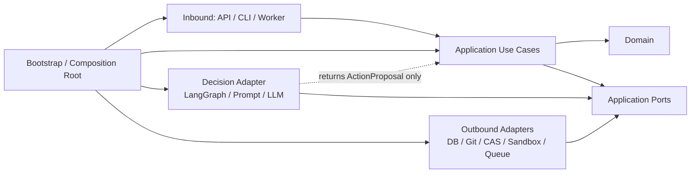

# GPT Architecture Review Result V2

* **Review date:** 2026-07-12
* **Reviewer model:** GPT-5.6 Thinking
* **GitHub access:** Yes
* **Tests executed:** No；本轮为设计复审与源码交叉检查，未重新运行测试
* **Repository baseline:** `main@86c59d375ce59f0226a3daa07d1c69133ed66cea`
* **Files reviewed:** 修订后的 v0.1 蓝图、`代码分层与架构治理规范.md`、第二轮送审包，以及仓库现有 README、主图、API、状态、多分支、Sandbox 等 Legacy 实现
* **Assumptions:** 一名全职开发者；Linux/WSL2 为正式执行环境；普通 CPU；使用小型固定测试仓库；v0.1 为本地单用户工具，不承担多租户或公网生产 SLA
* **Upload note:** 本轮上传的两份 26 KB 主设计文件内容相同；分层规范从仓库当前 `main` 分支读取

---

## 1. Second-round Verdict

**CONDITIONAL GO。**

与首轮相比，风险**显著下降**：产品范围、事实来源、安全边界和评测目标已经收敛，方案具备开工价值。但 Mission Contract 仍不足以确定真实执行；独立 Runtime 层可能绕过 Application Policy；Git、CAS 与数据库部分成功后的恢复协议尚未闭合。修正这三类问题后，可以开始第一条无 LLM 的 Vertical Slice。

### 判定边界

* **按当前文档直接全面开工：仍不建议。**
* **先完成本报告列出的 Pre-coding Checklist，再做基线复现 Vertical Slice：GO。**
* **首条 Vertical Slice 通过 Kill/Resume、Git/CAS 幂等和 Evidence Gate 后，再引入 LLM 修复：GO。**

修订后的设计已经明确放弃通用 Agent OS、多旗舰场景、独立 MCP Gateway、自动 Skill 晋升和多租户等范围，并将 v0.1 收缩为论文、仓库和有限目标驱动的复现任务。

仓库最新提交只修改了设计和分层文档，新 `research_forge` 实现尚未开始；当前 README 和运行代码仍描述并实现旧的固定 DAG、多分支与“可进化”系统。因此本轮是“方案可开工性”审查，不是新架构验收。

---

## 2. Updated Scorecard

| 维度     | 首轮 |    本轮 | 变化原因                                                                           |
| ------ | -: | ----: | ------------------------------------------------------------------------------ |
| 产品聚焦   |  3 | **8** | 从 Agent OS 和三个场景收缩为一个科研复现 Mission；但输入与改动预算仍需进一步冻结。                             |
| 技术差异化  |  4 | **7** | Claim→Evidence→Metric→Commit→环境/数据 Hash 的强制链条具备辨识度；差异仍需由真实 Bundle 和公开 Eval 证明。 |
| 架构合理性  |  5 | **7** | 单一事实来源、UoW、Outbox、真实 Git 和 CAS 明显改善；Runtime/Application 边界及跨系统恢复仍不完整。          |
| 一人可实现性 |  2 | **6** | 已删除大部分平台能力；若继续保留 Reviewer、Skills、MCP、Draft PR 和完整 16 项 Eval，8 周仍不现实。           |
| 安全性    |  3 | **6** | 安全默认值和 Broker 思路正确；依赖安装网络、Windows 边界和 Docker 高权限 Broker 仍需明确。                  |
| 可评测性   |  4 | **8** | 增加确定性硬门禁、冻结任务和防 Cherry-picking；应分阶段实现，不能一次完成全部测试矩阵。                            |
| 开源吸引力  |  4 | **6** | 新定位更可信；但仓库首页仍宣传旧 Agent OS、多路线、自动进化和 DPO，当前对外叙事冲突。                              |
| 面试展示价值 |  8 | **9** | Kill/Resume、真实 Worktree、CAS、Evidence Gate 与安全门禁形成很强的工程故事。                      |

**本轮综合成熟度：约 7.1/10。**

---

## 3. Accepted Fixes

以下修订真正解决了首轮的设计问题，但尚不代表代码已经落地。

### 3.1 产品范围已实质收缩

v0.1 不再承诺通用 Agent OS、Browser、Plugin Hub、多租户、五层记忆和多场景平台，而只承诺“论文 + 仓库 + 有限目标”的科研复现链路。这不是改名，而是删除了多数独立产品面。

### 3.2 差异化从基础设施转向可验证结果

新设计不再把 Skills、MCP、多 Agent 或 Git 分支本身当核心卖点，而把差异集中到：

```text
Claim → Evidence → Metric Artifact → Commit
→ Dataset Hash → Environment Hash → Reproduction Command
```

这一方向能够避开与通用 Agent Harness、Coding Workbench 和科研实验平台的正面功能竞赛。

### 3.3 事实来源职责已经基本正确

设计明确：

* PostgreSQL：业务状态、Approval、Claim/Evidence、Audit/Outbox；
* Git：代码、Diff、Branch、Commit；
* CAS：日志、指标、环境、补丁和 Bundle 字节；
* LangGraph Checkpoint：单个 Attempt 的临时上下文；
* Redis/Celery：仅运输。

同时明确不采用完整 Event Sourcing，避免新增另一套业务状态来源。相关规则已明确禁止在 API 内存、Redis Result Backend 和 LangGraph State 中重复维护业务真相。

### 3.4 长任务不再依赖 FastAPI BackgroundTasks

Lease、Heartbeat、条件更新、Cancel Token、Approval 后重新调度和幂等键已经进入正式模型，且删除了“Catch-All 后继续”的错误语义。

这是对当前 Legacy 实现的实质纠正：现有 API 仍使用 `BackgroundTasks` 和进程内 `_runs`，当前主图的 `safe_node` 仍会捕获任意异常后让流程继续。

### 3.5 Git-like 分支已被真实 Git Worktree 替换

Baseline/Candidate Worktree、Commit SHA、Diff 和指标绑定取代 SQLite Thread/Fork 模拟。这是首轮最关键的可信度修复之一。

### 3.6 Evidence Gate 从 Prompt 约束升级为类型和查询边界

Writer 被限制为只接收 `VerifiedClaimView`，并禁止读取完整 Mission State、实验计划或自由文本指标。方向正确，已具备代码级强制的基础。

### 3.7 Skill 与 MCP 已明显降级

不再建设独立 MCP Gateway，不允许自动生成、覆盖或晋升稳定 Skill，MCP 只作为 Infrastructure Adapter 的可选协议。规范也明确 MCP 只是连接协议，内部 Application Port 不应暴露 MCP 概念。

### 3.8 安全与评测采用硬门禁

Secret 泄露、宿主逃逸、未审批外部写入、Metric 无 Commit、重复副作用和 Unsupported Claim 写成事实均被定义为版本级失败，而非普通扣分项。

### 3.9 Legacy 迁移不再采用大爆炸重构

新包、Legacy Adapter、契约测试、Bootstrap 切换和删除旧 Adapter 的顺序总体合理，能够避免一次性推翻现有功能。规范已经禁止新核心能力继续进入旧固定 DAG，并要求迁移完成后删除 Legacy Adapter。

---

## 4. Remaining Blockers

## 4.1 Blocker

### B1. Mission Contract 仍不足以成为可执行契约

**问题**

当前输入只有论文、仓库、自然语言目标、指标名和方向。“一次明确修复”与“一次有限消融”仍然无法确定：

* 运行哪个 Commit；
* 使用哪个容器环境；
* 执行什么命令；
* 指标从哪里读取；
* 容差是多少；
* Agent 可以改哪些文件、多少行；
* 依赖升级是否允许；
* 修复失败后是否还能再次修改。

当前蓝图的输入契约仍停留在 `description + metric_name + expected_direction` 层面。

**影响**

同一 Mission 可被多个实现解释成完全不同的任务，导致成本、成功率、Evidence 和安全边界不可比较。

**具体修改**

将 v0.1 输入冻结为 `ReproductionSpec v1`：

```yaml
schema_version: 1
mode: reproduce | repair | ablation

paper:
  artifact_id:
  sha256:
  extraction_profile:

repository:
  url_or_path:
  commit_sha:

execution:
  image_digest:
  setup_mode: prebuilt | lockfile
  run_argv: []
  working_directory:
  timeout_seconds:
  network_policy: offline

metric:
  artifact_path:
  format: json
  json_pointer:
  comparator: equals | gte | lte
  expected_value:
  tolerance:

change_budget:
  allowed_paths: []
  max_files: 3
  max_changed_lines: 200
  max_candidate_commits: 1
  max_candidate_runs: 1
```

其中：

* `reproduce`：只执行基线；
* `repair`：允许一个 Candidate Commit，目标是使固定验收命令通过；
* `ablation`：必须由用户预先指定参数、原值和候选值，Agent 不得自行发明实验变量。

**验收条件**

一个不调用 LLM 的 Validator 可以仅根据 Spec 判断所有命令、指标、容差、改动范围和停止条件是否合法。

---

### B2. Runtime 层仍可能绕过 Application Policy

**问题**

规范允许 Runtime 依赖 Application Ports。若 Runtime 可以直接获得 `SandboxExecutor`、`WorkspaceManager` 或 `ArtifactStore`，则 Agent/LangGraph 仍可能绕过 Use Case、事务和 Policy 执行副作用。

规范一方面声明 Runtime 可以依赖 Application Ports，另一方面又声明 Runtime 只能提出动作、由 Application/Policy 决定是否允许。两者之间存在结构性缺口。

**影响**

文档虽然声称“Runtime 只提出动作”，依赖图却允许它直接调用执行能力；实际编码后很容易形成第二个编排中心。

**具体修改**

v0.1 不保留独立 Runtime 顶层架构。改为：

```text
Application 定义 DecisionEngine Port
LangGraphDecisionEngine 实现该 Port
Application Use Case 调用 DecisionEngine 得到 ActionProposal
Application Policy 校验 Proposal
Application 再调用 Side-effect Ports
```

决策实现只返回：

```python
ActionProposal(
    action_type=...,
    arguments=...,
    rationale_summary=...,
    expected_artifacts=...,
)
```

它不得持有 Git、Sandbox、Artifact、Queue 或 Repository Port。

**验收条件**

Import Test 能证明 `adapters/decision/**` 无法 import 任意 Side-effect Port 或 Outbound Adapter；所有 Tool Proposal 都必须经过 Application Use Case。

---

### B3. DB、Git 和 CAS 的部分成功恢复协议尚未定义

**问题**

设计正确地承认三者不能共享事务，但目前只有“幂等键”原则，没有明确：

* CAS 写成功、DB 提交失败怎么办；
* Git Commit 成功、Attempt Finalize 失败怎么办；
* DB 已完成、Queue ACK 前 Worker 崩溃怎么办；
* Retry 如何识别已有 Commit 或 Artifact。

当前规范明确要求 Sandbox Run、Artifact Put、Git Commit 和 Draft PR 使用幂等键，但没有给出跨存储恢复协议。

**影响**

Kill/Resume 测试很可能产生重复 Commit、孤儿 Artifact、错误的 Attempt 状态，或无法判断操作是否已经完成。

**具体修改**

增加 `operations` Ledger，所有跨系统副作用统一使用：

```text
PREPARED → EXECUTING → SUCCEEDED | FAILED | MANUAL_RECOVERY
```

每条记录至少保存：

* `operation_id`；
* `idempotency_key`；
* `attempt_id`；
* `operation_type`；
* 输入 Hash；
* 预期父 Commit/目标路径；
* 外部结果引用；
* `lease_epoch`；
* 状态和错误。

Git Commit 使用固定 Operation Trailer 或专用 Ref：

```text
Research-Forge-Operation: <operation_id>
```

CAS 使用内容 Hash 和原子 Rename，写入天然幂等。

**验收条件**

在以下四个故障点强制 Kill 后重试，结果均只有一个逻辑 Commit、一个 Artifact 注册和一个成功操作：

1. `PREPARED` 后、执行前；
2. CAS Rename 后、DB Finalize 前；
3. Git Commit 后、DB Finalize 前；
4. DB Finalize 后、Queue ACK 前。

---

## 4.2 High

### H1. 依赖安装与默认无网络存在冲突

**问题**

科研仓库通常需要安装依赖，而设计又要求执行默认无网络。当前未说明环境准备在哪个信任边界完成。

**具体修改**

采用两阶段：

1. `ENV_PREPARE`：只允许固定包索引或预置 Wheelhouse，输出环境或镜像 Digest；
2. `RUN`：完全离线，使用已冻结环境执行。

v0.1 优先支持“预构建镜像 Digest + 固定 Fixture Repo”，不要先解决任意仓库依赖。

**验收条件**

执行阶段没有网络连接；环境清单可以重新构建出相同依赖 Hash。

---

### H2. Legacy 双架构没有明确终止日期

**问题**

最新提交只修改文档；README 仍把项目描述为多路线、可回放、可进化的“研究操作系统”，并继续宣传 LLM Winner、MCP、自动 Skill、Prompt A/B 和 DPO。新旧架构的对外叙事已经冲突。

**具体修改**

* 立即将 README 顶部改为 v0.1 目标，并把旧系统标为 `legacy-demo`；
* 新包不得 import Legacy 内部模块，只允许显式 Legacy Adapter；
* 设定删除门槛：首条 Baseline Vertical Slice 稳定后，最多保留两个发布周期；
* 迁移完成前，不新增 Legacy 功能。

**验收条件**

README 核心宣称均能链接到新架构代码或明确标记为 Legacy；CI 阻止 `research_forge` 直接 import `co_scientist.*` 内部路径。

---

### H3. Exact-span Evidence 和 Writer 门禁仍需更强定义

**问题**

PDF 文本会因版本、解析器和排版产生偏移。单纯保存“精确段落”不足以稳定复核。`VerifiedClaimView` 也不能阻止 Writer 模块另行访问数据库或旧 State。

**具体修改**

`PAPER_SPAN` 至少保存：

* 源 Artifact SHA-256；
* 原始 URI 和版本；
* 解析器名称和版本；
* Page Index；
* Canonical Extracted Text Offset；
* Excerpt Hash；
* 可选 Bounding Box；
* 提取时间。

Writer 只暴露：

```python
generate_report(input: VerifiedReportInput) -> ReportArtifact
```

`VerifiedReportInput` 是不可变 DTO，构造时已完成 Evidence Closure 检查。Writer 不获得 UoW、Claim Repository、Mission Repository 或 Workspace 访问权限。

**验收条件**

* Unsupported/Conflicted Claim 无法构造 `VerifiedReportInput`；
* Writer 包的 Import Test 禁止访问通用 Repository 和 Legacy State；
* 更换 PDF 解析器后，旧 Evidence 会明确失效或通过原 Artifact/解析器重放。

---

### H4. Reviewer、Skills、MCP 和 Draft PR 仍不应进入 v0.1

**问题**

它们虽被降级，但仍出现在 v0.1 架构与路线中，会诱导开发者提前建设 Manifest、Router、MCP Schema Hash、审批和 GitHub 写入。

**具体修改**

v0.1 完全删除：

* Reviewer；
* First-class Skill Package；
* MCP Adapter；
* Draft PR。

普通复现步骤先作为版本化 Python Recipe 或 Prompt 实现；论文输入只支持本地文件和一个明确 HTTP Adapter。

**验收条件**

v0.1 Milestone 中没有上述功能的 Issue；第一版依赖列表不需要 MCP SDK 或 GitHub 写入凭据。

---

### H5. 8 周同时完成安全、全链路、16 项 Eval 和 UI 仍然偏乐观

**具体修改**

按 10 周核心开发 + 2 周发布缓冲规划。第 6 周前不引入 LLM；第 9 周前不做报告生成和 UI。

**验收条件**

每阶段有独立退出条件；任何阶段失败时能够发布较小的 Runtime/Git/CAS Alpha，而不是继续堆功能。

---

## 4.3 Medium

### M1. Research Bundle 顶层文件略碎

建议合并：

* `mission-manifest.json`
* `source-manifest.json`
* `audit-summary.json`

为：

```text
bundle-manifest.json
```

保留独立的：

* `environment.lock`
* `dataset-manifest.json`
* `claims.jsonl`
* `evidence.jsonl`
* `report.md`
* `reproduce.sh`
* `artifacts/`

这样减少 Schema 同步和版本迁移面。

### M2. 部分架构规则应是审查阈值，不应成为 CI Blocker

以下适合 Code Review，不适合机械阻断：

* 文件 400 行；
* 函数 60 行；
* 构造依赖 7 个；
* 每个关键 Port 都必须立即拥有 Production + Fake；
* Route 永远只能调用一个 Use Case；
* 所有中型 PR 都必须提供完整兼容期。

规范本身也将文件、函数和构造器阈值定义为审查阈值，而不是绝对限制，这个定位应继续保持。

真正的 CI Blocker 应聚焦依赖方向、循环、框架泄漏、公共 API 和事实来源写入。

---

## 5. Layering Review

## 5.1 Domain

**评价：正确，保留。**

负责 Entity、Value Object、状态机和不变量。建议：

* 使用 dataclass、Enum 和纯类型；
* 不在 Domain 使用 Pydantic、SQLAlchemy 或 LangGraph；
* Domain Event 只作为数据结构，不承担 Event Sourcing；
* `MissionStatus`、`AttemptStatus`、`ClaimStatus` 分属各自 Aggregate，避免一个全局状态枚举。

## 5.2 Application

**评价：正确，是架构中心。**

它应独占：

* 用例；
* UoW 和事务边界；
* Object-level Authorization；
* Policy；
* 幂等；
* 状态迁移协调；
* Outbox；
* Side-effect 调度。

需要收紧的是：Application 不能把“事务”只定义成抽象概念。`UnitOfWork` 必须明确提供 Repository、Audit、Outbox 和 `commit/rollback` 语义。

## 5.3 Runtime

**评价：概念有用，独立顶层层次不必要。建议合并。**

Agent/LangGraph 是“决策实现”，不是新的业务层。将其保留为独立层会产生两种编排中心：

* Application Use Case；
* Runtime Workflow。

建议改为 `DecisionEngine` Adapter。Prompt、Context、LangGraph、Agent 和未来 Skill 放在：

```text
adapters/decision/
```

Application 决定什么时候请求 Proposal，决策 Adapter 只生成 Proposal。

## 5.4 Infrastructure

**评价：职责基本正确，但名称过宽。**

建议物理上改名为：

```text
adapters/outbound/
```

内部按能力划分：

* persistence；
* queue；
* git；
* artifacts；
* sandbox；
* research；
* llm。

不要建立通用 `infrastructure/services.py` 或共享 SDK Client 单例。

## 5.5 Interfaces

**评价：正确，可改名为 `adapters/inbound`。**

API、CLI、Worker 都是驱动 Application 的入站 Adapter。

依赖规则：

* 默认只依赖 Application Command/View DTO；
* 可以使用由 Application 重新导出的 ID 或枚举；
* 不应直接依赖 Domain Entity；
* Worker Message 只含 ID、Operation 和 Idempotency Key；
* API Token 校验属于协议层，Mission 访问权限属于 Application。

## 5.6 Bootstrap

**评价：保留，但必须限制为 Composition Root。**

禁止：

* `container.get("service")` 在业务代码中到处使用；
* 在 Bootstrap 写业务 `if/else`；
* 把全局可变 Container 暴露给 Route；
* Bootstrap 反向被其他层 import。

建议提供显式工厂：

```python
build_api_app(settings) -> FastAPI
build_worker(settings) -> WorkerRuntime
```

## 5.7 建议的物理结构

```text
backend/research_forge/
├── domain/
│   ├── mission/
│   ├── execution/
│   ├── artifact/
│   ├── evidence/
│   └── approval/
├── application/
│   ├── use_cases/
│   ├── ports/
│   ├── dto/
│   └── policies/
├── adapters/
│   ├── inbound/
│   │   ├── api/
│   │   ├── cli/
│   │   └── worker/
│   ├── decision/
│   │   └── langgraph/
│   └── outbound/
│       ├── persistence/
│       ├── queue/
│       ├── git/
│       ├── artifacts/
│       ├── sandbox/
│       ├── research/
│       └── llm/
└── bootstrap/
```

## 5.8 修正后的依赖图



图中的 Adapter → Port 表示“实现或依赖接口”，不是 Adapter 可直接改变业务状态。

## 5.9 至少 10 条自动 Architecture Rules

建议使用 **import-linter + mypy/pyright + 自定义 AST 测试**。`pytestarch` 不是必需。

1. `domain` 禁止 import `application/adapters/bootstrap`。
2. `domain` 禁止 import FastAPI、Pydantic、SQLAlchemy、LangGraph、Celery、Redis、Docker、HTTP/LLM SDK。
3. `application` 禁止 import `adapters/bootstrap` 和所有具体供应商 SDK。
4. `adapters/inbound` 禁止 import `adapters/outbound`。
5. `adapters/decision` 禁止 import Git、Sandbox、Artifact、Queue、Persistence Adapter。
6. `adapters/decision` 只能 import 白名单 Port：`DecisionModel`、`Clock` 和只读 Context DTO。
7. `adapters/outbound` 只能依赖 Application Ports/DTO 和 Domain Public Types。
8. 除 Bootstrap 外，任何模块禁止 import `bootstrap`。
9. 新架构禁止 import `co_scientist.*` 内部路径；只有 `adapters/outbound/legacy/**` 可例外。
10. 任何跨模块 import 禁止指向 `_internal.py`、以下划线开头模块或非公开子路径。
11. `os.getenv` 和 `.env` 读取只允许出现在 Bootstrap/Settings Adapter。
12. `sqlalchemy` 与 ORM Model 只允许出现在 Persistence Adapter。
13. `docker`、Docker Socket、容器创建只允许出现在 Sandbox Broker。
14. `subprocess` 执行 Git 只允许在 Git Adapter；任意 Shell 执行只允许在 Sandbox。
15. FastAPI Route 禁止 import Repository、ORM、Git、Docker、LLM Client。
16. Worker Task 函数禁止包含业务状态迁移，只能调用 Application Use Case。
17. 新包禁止 import `ResearchState`。
18. 公共函数签名禁止裸 `dict`、`dict[str, Any]` 和供应商 SDK 类型。
19. Writer 包只能 import `VerifiedReportInput`、`ReportArtifact` 和 `ModelGateway`。
20. Import Graph 必须无循环。

分层规范已经要求 CI 自动检查 Domain、Application、Runtime、Interfaces 的依赖边界和循环依赖；建议将其落地为明确的 Import Contracts，而不是只留在文档。

## 5.10 最可能重新产生耦合的三个位置

1. **ActionProposal / Workflow Schema**：若不断加入不同工具的任意字段，会重新变成巨大 State。
2. **UnitOfWork**：若一个 UoW 暴露所有 Repository，任意 Use Case 都能跨模块写表。
3. **Artifact–Metric–Evidence 关联**：若三者共享一个通用 JSONB Manifest，任何 Schema 改动都会级联。

## 5.11 自动检查与 Code Review 的边界

### CI Blocker

* 依赖方向；
* 循环依赖；
* SDK 和框架越层；
* 非公开模块 Import；
* Route/Worker 直连 Adapter；
* Legacy 越界；
* Writer 越权；
* 公共 DTO 类型；
* `.env`、Docker、ORM 的路径白名单。

### Code Review 建议

* 是否真的需要新 Port；
* Use Case 是否过大；
* 文件和函数长度；
* 是否应拆模块；
* Handoff 内容是否最小；
* Compensation 是否合理；
* 命名和目录是否清楚；
* 抽象是否只有一个实现且没有测试价值。

## 5.12 如何量化耦合是否下降

建议观察而非全部阻断：

* Import Cycle 数量：必须为 0；
* Architecture Violation 数量：必须为 0；
* 跨业务模块直接 Import 数；
* 通过 Public API 的跨模块 Import 比例；
* 单个 Port 变更需要修改的 Adapter 数；
* PR 触及的业务模块数量中位数与 P90；
* Git History 中经常共同修改的文件对；
* `shared/common/utils` 新增行数；
* 公共 DTO/Port 的变更频率。

---

## 6. Source-of-truth and Failure Review

## 6.1 修正后的事实来源表

| 事实                      | 唯一可写主人                     | DB 保存什么                             | 恢复依据                         |
| ----------------------- | -------------------------- | ----------------------------------- | ---------------------------- |
| Mission/Task/Attempt 状态 | PostgreSQL                 | 完整当前状态、Version、Lease                | DB 条件更新                      |
| 操作生命周期                  | PostgreSQL `operations`    | 输入 Hash、幂等键、外部结果 Ref                | Operation Reconciler         |
| 代码内容                    | Git Object Database        | Repo/Ref/Commit SHA 索引              | Commit/Ref/Operation Trailer |
| Artifact 字节             | Local CAS                  | SHA、大小、类型、关联和生命周期                   | Hash + 原子文件                  |
| Metric 语义               | Metric Artifact + DB 结构化索引 | JSON Pointer、数值、单位、Commit/环境/数据 Ref | Artifact 重读                  |
| Agent 临时上下文             | Attempt Checkpoint Store   | Checkpoint Ref 和生命周期                | Attempt/Parent Attempt       |
| Claim/Evidence 状态       | PostgreSQL                 | Claim、Edge、Validation State         | DB 约束和 Validator             |
| 队列消息                    | 无事实权威                      | Outbox ID、投递状态                      | Outbox 重投                    |
| UI Timeline             | 无事实权威                      | Audit Event                         | DB 查询                        |

CAS 拥有“字节真相”，PostgreSQL 拥有“该 Artifact 是否正式注册并属于哪个执行”的业务真相。

## 6.2 Artifact 部分成功算法

```text
1. DB Transaction:
   create operation(PREPARED, input_hash, attempt_id)
   commit

2. 写 CAS staging 文件
3. 计算 SHA-256、fsync
4. atomic rename 到 cas/<sha>
   若已存在，校验大小和 Hash 后复用

5. DB Transaction:
   lock operation
   insert artifact manifest / relation / metric index
   operation → SUCCEEDED
   attempt version condition update
   audit + outbox
   commit
```

恢复：

* `PREPARED/EXECUTING` 操作重试时先按 SHA 查 CAS；
* Blob 存在则跳过写入并完成注册；
* 未被任何 DB Manifest 引用的 Blob 在 TTL 后由 GC 删除；
* Manifest 已存在时 Put 返回同一 ArtifactRef。

## 6.3 Git Commit 部分成功算法

```text
1. DB 创建 PREPARED GitOperation:
   expected_parent_sha
   patch_hash
   operation_id
   target_ref

2. Git Adapter:
   校验 target_ref 当前仍等于 expected_parent_sha
   应用 Patch
   创建 Commit，附 Operation Trailer
   用 git update-ref <ref> <new_sha> <expected_parent_sha>

3. DB Finalize:
   保存 commit_sha
   operation → SUCCEEDED
   关联 Attempt/Metric
   audit + outbox
```

恢复：

* 重试先查询专用 Operation Ref 或 Commit Trailer；
* 找到相同 `operation_id + patch_hash` 时复用 SHA；
* Ref 已被其他操作推进则产生 `ConcurrencyConflict`，不能强推；
* Git 中存在 Commit、DB 未 Finalize 时由 Reconciler 补记；
* 禁止仅通过 Commit Message 文本模糊搜索。

## 6.4 Lease/Heartbeat 算法

领取：

```sql
UPDATE attempts
SET status='RUNNING',
    lease_owner=:worker,
    lease_epoch=lease_epoch+1,
    lease_expires_at=clock_timestamp()+interval '30 seconds',
    version=version+1
WHERE attempt_id=:id
  AND status IN ('PENDING','RETRYABLE','RUNNING')
  AND (lease_expires_at IS NULL OR lease_expires_at < clock_timestamp())
RETURNING lease_epoch, version;
```

所有 Worker 更新必须带：

```text
attempt_id + lease_owner + lease_epoch + expected_version
```

规则：

* 使用数据库时间，不使用 Worker 本地时间；
* Heartbeat 只在 Token 或 Epoch 匹配时续租；
* 旧 Worker 在 Lease 丢失后不能提交状态；
* 每次外部副作用前后重新检查 Cancel 和 Lease；
* Worker Crash：同一 Attempt 可重领并使用同一 Checkpoint；
* 逻辑重试：创建新 Attempt；
* Approval 续跑：创建子 Attempt，引用不可变的父 Checkpoint。

## 6.5 Checkpoint 生命周期

* Namespace：`mission_id/task_id/attempt_id`；
* Worker Crash 后继续同一 Attempt；
* Retry 创建新 Attempt，不覆盖旧 Checkpoint；
* Approval 后新 Attempt 使用 `resume_from_checkpoint_ref`；
* Terminal Attempt 的 Checkpoint 只读；
* Bundle 成功生成且无后代 Attempt 后进入 Retention；
* 默认保留 7–30 天，再由 GC 删除；
* Checkpoint 删除不影响 Mission 状态、Git、Artifact 和 Audit。

## 6.6 Draft PR 与 Compensation

v0.1 建议完全推迟 Draft PR。

未来实现时：

* `external_operations` 先进入 PREPARED；
* PR Body 写入 Operation Marker；
* Retry 先查 Marker，避免重复 PR；
* Mission Cancel 不自动关闭已创建 PR；
* 是否关闭属于新的显式用户操作；
* 无法安全补偿时进入 `MANUAL_RECOVERY`，不要假装回滚。

## 6.7 必须保持的事务边界

以下必须在同一 PostgreSQL 事务：

1. Mission/Task/Attempt 状态迁移 + Version + Audit + Outbox；
2. Lease Claim、Heartbeat 和 Release；
3. Approval 决策 + 待恢复 Task/Attempt 状态 + Audit + Outbox；
4. Operation Finalize + 外部结果 Ref + Attempt 条件更新 + Audit；
5. Artifact Manifest 注册 + Attempt/Run 关联 + Metric 索引；
6. Claim 状态 + Evidence Edge + Validation Result；
7. Mission `VERIFYING → COMPLETED` + Bundle Artifact Ref + 完整性检查结果。

Git、CAS 和 Sandbox 不在 DB 事务中，必须通过 Operation Ledger 和 Reconciler 衔接。

---

## 7. Security Minimum

## 7.1 v0.1 Blocker

1. **正式执行平台限定为 Linux 或 WSL2。** Windows 原生仅作为 UI/开发环境，不宣称与 Linux 等价的隔离。
2. API 默认绑定 Loopback，随机本地 Bearer Token，严格 Origin；Token 文件权限最小化。
3. API、普通 Worker 不得访问 Docker Socket；Sandbox Broker 是唯一 Docker 权限持有者。
4. Broker 必须是独立进程或独立本地服务；否则不能声称 Docker Socket 已隔离。
5. 容器非 root、Read-only RootFS、`cap_drop=ALL`、`no-new-privileges`、PID/CPU/内存/磁盘/时间限制。
6. 使用固定镜像 Digest，不使用可漂移 Tag。
7. Workspace Path 必须 `resolve()` 后验证 Root，并拒绝 Symlink/Junction 逃逸。
8. 运行阶段默认无网络；环境准备阶段只允许固定包源。
9. 禁止不可信 Pickle；安全解压并限制文件数、单文件大小、总解压大小和压缩比。
10. Canary Secret 测试覆盖 Prompt、日志、异常、Trace、Artifact 和 Bundle。
11. Agent/Decision Engine 不获得 Secret；Provider Adapter 在调用边界读取最小 Secret。
12. 未审批外部写入为零；v0.1 最好不实现任何外部写入。

## 7.2 v0.1 Should Have

* Rootless Docker 或 Podman；
* 依赖 Wheelhouse 或缓存代理；
* SBOM、Secret Scan、Dependency/License Scan；
* Local CAS 目录权限与原子写；
* Artifact MIME/Schema 校验；
* 容器 stdout/stderr 大小上限；
* Git 仓库大小、LFS 和子模块策略；
* 每 Mission 的并发、成本和磁盘配额；
* Broker API 的本地 ACL 和请求大小限制。

## 7.3 Linux-only Hardening

* Docker 默认 Seccomp Profile：**Must**；
* `cap_drop=ALL` 与 `no-new-privileges`：**Must**；
* AppArmor/SELinux Profile：**Should Have**；
* Rootless Docker：**Should Have**；
* gVisor、Kata 或 microVM：**Later**，不应阻塞 v0.1；
* eBPF Runtime Detection：Later。

## 7.4 Windows/Docker Desktop 边界

在 Windows 上，即使只有 Broker 打开 Docker Named Pipe，同一 Windows 用户下的恶意本地进程仍可能直接访问 Docker Desktop；Broker 主要隔离的是 Agent/API 进程，不是恶意宿主用户。

因此：

* 推荐 WSL2 内运行 Backend、Worker 和 Broker；
* 文档明确威胁模型不防御已控制本地用户账户的攻击者；
* 不在 Windows 原生环境运行 Security Gate 的正式发布验收。

## 7.5 Secret Broker 是否过度设计

完整 Vault 或独立 Secret Service 对本地 MVP 过度设计。保留一个小型 `SecretProvider` Port 即可：

* Bootstrap 读取环境或本地 Keyring；
* Outbound Provider Adapter 按名称短时取得 Secret；
* 不把 Secret 放入 Domain、Application DTO、Prompt 或 Checkpoint；
* 不需要独立 Secret 微服务。

## 7.6 CI 中的安全测试

### 普通 GitHub Runner 可稳定运行

* 路径穿越；
* Symlink；
* Zip Bomb 限制；
* Prompt Injection Policy；
* Secret Canary；
* Payload/Schema Limit；
* Artifact Tamper；
* 未审批外部写入。

### 仅 Linux Docker Job 或 Self-hosted Runner

* 容器 Network None；
* Capabilities；
* Read-only RootFS；
* PID、Memory 和 Timeout；
* Worker Kill/Resume；
* Broker 权限。

AppArmor、Rootless 和 gVisor 不应在所有 PR 上作为通用 CI Blocker。

---

## 8. Revised Vertical Slice

第一条 Vertical Slice 应当**完全不包含 LLM、LangGraph、Skill、MCP、Reviewer、Writer 和 UI**。它先证明系统的事实来源和恢复语义正确。

## 8.1 场景

输入一个仓库 Fixture：

```text
tests/fixtures/toy_reproduction_repo
```

固定：

* Commit SHA；
* 预构建 Python 镜像 Digest；
* `run_argv=["python", "evaluate.py", "--output", "metrics.json"]`；
* Metric JSON Pointer：`/accuracy`；
* Golden：`0.80 ± 0.001`；
* 网络：offline；
* 模式：reproduce。

## 8.2 涉及模块

```text
domain/
  mission/model.py
  execution/model.py
  artifact/model.py

application/
  dto/reproduction_spec.py
  ports/unit_of_work.py
  ports/task_queue.py
  ports/workspace.py
  ports/sandbox.py
  ports/artifact_store.py
  use_cases/create_mission.py
  use_cases/run_baseline_attempt.py
  use_cases/finalize_baseline.py

adapters/inbound/
  api/missions.py
  worker/run_attempt.py

adapters/outbound/
  persistence/postgres/
  queue/celery/
  git/cli_workspace.py
  artifacts/local_cas.py
  sandbox/broker_client.py

bootstrap/
  api.py
  worker.py
```

## 8.3 状态迁移

```text
DRAFT
→ READY
→ RUNNING
→ VERIFYING
→ COMPLETED

失败：
RUNNING/VERIFYING → FAILED

取消：
RUNNING → CANCELLING → CANCELLED
```

Task：

```text
BASELINE_REPRODUCTION
```

Attempt 只执行一次固定命令。

## 8.4 Port/Adapter

| Port              | Production Adapter  | Fake                     |
| ----------------- | ------------------- | ------------------------ |
| UnitOfWork        | SQLAlchemy/Postgres | InMemoryUoW              |
| TaskQueue         | Celery/Redis        | ImmediateQueue           |
| WorkspaceManager  | Git CLI Worktree    | TempDirGitFixture        |
| SandboxExecutor   | Broker Client       | DeterministicFakeSandbox |
| ArtifactStore     | Local CAS           | InMemoryCAS              |
| Clock/IdGenerator | System              | Fixed                    |

第一条 Slice 不需要 `DecisionEngine`。

## 8.5 输出

```text
bundle/
├── bundle-manifest.json
├── reproduce.sh
├── environment.lock
├── dataset-manifest.json
├── claims.jsonl
├── evidence.jsonl
└── artifacts/
    ├── metrics.json
    └── execution.log
```

报告可以先由确定性模板生成，不调用 LLM。

## 8.6 测试

1. Domain 状态机；
2. UoW Commit/Rollback；
3. Adapter Contract；
4. Worktree 隔离；
5. CAS 相同内容去重；
6. Artifact Tamper；
7. Metric Extractor；
8. Worker Kill before ACK；
9. CAS 完成、DB 未 Finalize；
10. Cancel 停止 Sandbox；
11. Lease 过期后旧 Worker无法 Finalize；
12. 完整 E2E 生成可重放 Bundle。

## 8.7 Demo

1. POST 创建 Mission；
2. Worker 领取 Attempt；
3. Baseline Worktree 创建；
4. 启动 Sandbox；
5. 人工 Kill Worker；
6. 新 Worker 重领同一 Attempt；
7. 检测已有 Operation/CAS；
8. 完成指标注册；
9. 生成 Bundle；
10. 执行 `reproduce.sh` 得到同一指标。

第二条 Slice 才加入 `repair` 模式、DecisionEngine 和一个 Candidate Commit。

---

## 9. Revised Roadmap

建议 **10 周核心开发 + 2 周发布缓冲**。8 周可以形成 Alpha，不适合承诺完整 v0.1。

| 周  | 目标                | 交付物                                                            | 退出条件                                     |
| -- | ----------------- | -------------------------------------------------------------- | ---------------------------------------- |
| 1  | Scope 与 ADR 冻结    | ReproductionSpec v1；五份核心 ADR；README 改版；Fixture Repo            | 无 LLM 即可验证 Mission 输入是否合法                |
| 2  | 最小分层骨架            | Domain/Application/Adapters/Bootstrap；Import-linter；Mypy；基础 CI | 20 条 Architecture Rules 中核心规则通过          |
| 3  | 状态与事务             | Mission/Task/Attempt/Operation；UoW；Audit/Outbox；Alembic        | 并发状态更新、Rollback、Outbox 测试通过              |
| 4  | Worker            | Celery Transport；Lease/Epoch；Heartbeat；Cancel；Reclaim          | Kill/Resume 不产生重复 DB 状态                  |
| 5  | Git 与 CAS         | Baseline Worktree；Operation Ref；Local CAS；GC                   | Git/CAS 四个故障点恢复测试通过                      |
| 6  | Sandbox 与第一 Slice | Broker；固定镜像；Offline 执行；Metric Extractor；Bundle                 | 无 LLM Baseline Demo 可连续运行 10 次           |
| 7  | Evidence Gate     | Metric/Evidence/Claim Schema；Verified DTO；确定性报告模板              | Unsupported/Conflicted Claim 无法进入 Bundle |
| 8  | 安全与环境准备           | Allowlisted Prepare；Secret Canary；Archive/Path Tests           | v0.1 Blocker Security Set 全绿             |
| 9  | Candidate Repair  | DecisionEngine Port；LLM Adapter；一个 Patch/Commit/Run            | 固定 Repair Fixture 成功且遵守 Change Budget    |
| 10 | Minimal API/UI    | Mission、Timeline、Diff、Bundle；不做通用 Canvas                       | 新用户 10 分钟内跑完 Fixture                     |
| 11 | Eval 与硬化          | 先运行 8 个核心 Case，每个三次；修复竞态                                       | 无硬门禁失败，发布全量失败记录                          |
| 12 | Release Buffer    | 扩展到 16 Case；文档、Demo、v0.1.0                                     | Demo 连续三次成功；Bundle 可由第三方复评               |

## 9.1 可以推迟

* Reviewer；
* Skill Manifest/Router；
* MCP；
* Draft PR；
* PDF Bounding Box UI；
* 高级前端；
* Semantic Memory；
* 多 Candidate Worktree；
* AppArmor/gVisor 的跨平台抽象；
* 完整 16 Case 到 Week 12 前的所有在线运行。

## 9.2 止损条件

1. **Week 3 结束**仍无法稳定完成状态 + Audit + Outbox 原子提交：暂停所有 Agent 工作。
2. **Week 5 结束**Git/CAS 故障注入仍产生重复或丢失：不得进入 LLM Repair。
3. **Week 6 结束**无 LLM Baseline Slice 不能连续成功 10 次：缩减为 Runtime/Git/CAS Alpha。
4. Sandbox 无法阻止路径逃逸、网络或 Secret Canary：不得发布“代码执行”能力。
5. 单个 Fixture Mission 中位耗时超过 15 分钟或成本超过预设上限：进一步限制仓库与任务。
6. Week 10 仍有任一硬安全门禁失败：不发布 v0.1，只发布技术预览。
7. Legacy 与新包出现双向 Import：停止迁移并先修复边界。

---

## 10. Final Pre-coding Checklist

正式重构前必须完成：

1. **冻结 `ReproductionSpec v1`**：明确 Mode、Commit、命令、Metric Pointer、容差和 Change Budget。
2. **ADR-001：Layering**：决定删除独立 Runtime 层，使用 `DecisionEngine` Adapter。
3. **ADR-002：Source of Truth**：明确 PostgreSQL、Git、CAS、Checkpoint 和 Queue 的所有权。
4. **ADR-003：Cross-store Operations**：定义 Operation Ledger、Git Trailer/Ref、CAS 原子写和 Reconciler。
5. **ADR-004：Worker Semantics**：定义 Lease Epoch、Heartbeat、Cancel、Crash Resume、Retry 和 Approval Resume。
6. **ADR-005：Sandbox Platform**：正式支持 Linux/WSL2，定义 Environment Prepare 与 Offline Run。
7. **立即修改 README**：新定位置顶，旧系统标记 Legacy，不再用 Agent OS 和自动进化作为当前卖点。
8. **建立 Fixture Repository 和 Golden Metric**：第一条 Slice 的输入、输出和容差在编码前冻结。
9. **先建立 Architecture CI**：Import-linter、类型检查、Legacy Import Gate 和关键 AST Rules。
10. **冻结 Legacy Sunset 条件**：新 Slice 稳定后最多保留两个发布周期，不允许长期双架构。
11. **冻结 v0.1 删除清单**：Reviewer、Skills、MCP、Draft PR、Browser、Memory 不进入当前 Milestone。
12. **冻结发布硬门禁与止损条件**：任何 Secret、逃逸、重复副作用或 Unsupported Claim 都阻断发布。

---

## 最终结论

**第二轮仍为 CONDITIONAL GO，但已从“方向性收缩建议”进步为“接近可编码的系统设计”。**

开工前最重要的不是继续补充文档，而是完成三件事：

1. 把 Mission Contract 收紧为机器可验证的 `ReproductionSpec v1`；
2. 删除 Runtime 对 Side-effect Port 的直接依赖；
3. 用 Operation Ledger 和故障注入测试闭合 DB/Git/CAS 一致性。

完成后，应直接建设无 LLM 的 Baseline Vertical Slice。该 Slice 通过之前，不应编写 Reviewer、Skill、MCP、自动修复或复杂 UI。
