# Research Studio Agent Topology

```mermaid
flowchart LR
    U[Researcher] --> M0[M0 candidate directions]
    M0 --> H[Human topic selection / M1 clarification]
    H --> M2[M2 query rewrite]
    M2 --> S1[arXiv]
    M2 --> S2[Semantic Scholar]
    M2 --> S3[OpenAlex]
    S1 & S2 & S3 --> RRF[RRF + time decay + citation chase + rerank]
    RRF --> M3[M3 GapCard]
    M3 --> O[M4 Orchestrator]
    O --> N[Novelty reviewer]
    O --> T[Methodology reviewer]
    O --> D[Devil reviewer]
    N & T & D --> V{Variance > threshold?}
    V -->|yes| D2[Devil Round 2]
    V -->|no| META[Meta reviewer]
    D2 --> META
    META --> P[M5 plan + deterministic validator]
    P --> G[M5.5 gate recommendation]
    G --> C[M6 code suggestion / bounded execution feedback]
    C --> W[M7 report draft]
    W --> X[UNVERIFIED Proposal]
```

## Roles are specialized calls, not fictional independent workers

| Step | Role | Execution model | Output |
| --- | --- | --- | --- |
| M4 Orchestrator | selects 3–5 reviewer personas and always includes Devil | one `chat` call plus deterministic sanitation | selection reason and fallback state |
| M4 reviewers | novelty, methodology, reproducibility, statistics, Devil | same review function with isolated persona context; parallel fan-out | independent critique cards |
| Round 2 Devil | re-critiques a concise Round 1 summary only on high variance | conditional single call | additional critique card |
| Meta reviewer | concentrates critique cards into a decision | one critical-model call, reasoner fallback | decision and rating |
| M2 retrieval tools | arXiv, Semantic Scholar, OpenAlex | concurrent async calls | candidate papers plus ranked fusion |
| M6 repair proposer | produces a bounded file patch after execution feedback | optional, bounded retry | unverified code change suggestion |

## Trace event taxonomy

| Event type | Produced when | Key fields |
| --- | --- | --- |
| `node.started` / `node.completed` | a LangGraph stage begins or returns | node, outcome, duration |
| `node.degraded` | a stage raises but `safe_node` captures it | error summary, `DEGRADED` outcome |
| `orchestrator.selection` | reviewer set is sanitized | selected personas, reason, fallback |
| `reviewer.started` / `reviewer.completed` / `reviewer.failed` | an isolated review runs | reviewer role, rating, duration |
| `roundtable.disagreement` | Round 1 variance is calculated | variance, threshold, `round2_triggered` |
| `devil.round2_started` | variance triggers the second critique | parent roundtable step |
| `meta.decision` | Meta reviewer returns a decision | decision and rating |
| `tool.search_started` / `tool.search_completed` | retrieval fan-out/fan-in executes | query count, source counts, result count |
| `code.execution_failed` | bounded execution reports failure | safe error summary and attempt |
| `code.repair_proposed` / `code.repair_applied` | the code repair loop changes files | changed paths and attempt |

Event summaries deliberately exclude full prompts, source code, secrets, and raw provider payloads.
They are an operational explanation, not a hidden second source of research evidence.
