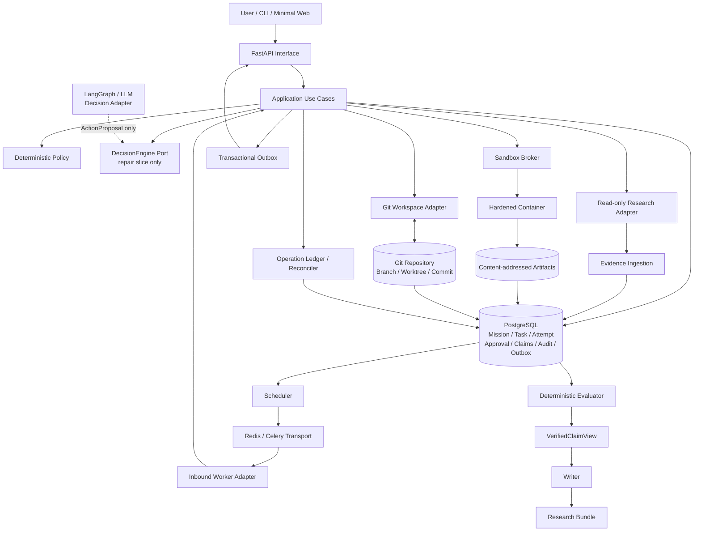

# Research Forge v0.1：证据门控的科研复现 Agent

> 文档版本：2.2（第二轮 GPT 架构审查后修订）
>
> 文档状态：Second Review Candidate
>
> 仓库：`chasen2041maker/research-forge`  
>
> 修订日期：2026-07-12
>
> 代码分层规范：[`代码分层与架构治理规范.md`](./代码分层与架构治理规范.md)

---

## 0. 架构决策

第二轮 GPT 审查结论为：

> **CONDITIONAL GO：风险显著下降；完成 Spec、分层和跨存储恢复协议后，可以开始无 LLM Vertical Slice。**

本版接受两轮审查结论，不再把以下内容作为 v0.1 目标：

- 通用 Agent OS；
- Research、Coding、Browser 三个旗舰场景同时开发；
- MCP Gateway 独立服务；
- Plugin Hub；
- 九个 Agent 团队；
- 五层长期记忆；
- 自动安装、生成或晋升 Skill；
- Neo4j、Qdrant、Kubernetes 和多租户；
- DPO 数据工厂；
- 以 LLM 自评分决定研究成功。

本版额外冻结：

- [`科研复现任务规范 v1`](../规范/科研复现任务规范_v1.md)；
- [`基线复现纵向切片规范`](../规范/基线复现纵向切片规范.md)；
- [`ADR-001` 至 `ADR-005`](../架构决策记录/)；
- Application-Centric Hexagonal Architecture；
- DB/Git/CAS Operation Ledger 和 Reconciler；
- Linux/WSL2 正式执行边界。

v0.1 只交付一个可验证故事：

> **论文 + 代码仓库 + 有限目标 → 基线复现 → 一次修复或消融 → Verified Claims → Reproducible Research Bundle。**

长期愿景可以保留在 Roadmap，但不能出现在 v0.1 的功能承诺和 README 核心卖点中。

---

## 1. 产品定位

### 1.1 英文定位

> **An evidence-gated research reproduction agent that turns papers and repositories into auditable Git experiments, claim-level provenance, and reproducible evaluation bundles.**

### 1.2 中文定位

> **一个证据门控的科研复现 Agent，把论文与代码仓库转化为可审计的 Git 实验、逐条结论溯源和可复评交付包。**

### 1.3 核心差异

Research Forge 不竞争“Agent 数量最多”或“功能最全”，只竞争以下完整链条：

```text
Claim
  → Evidence
  → Metric Artifact
  → Git Commit
  → Dataset Hash
  → Environment Hash
  → Reproduction Command
```

任何最终结论必须能沿着这条链追溯。缺少任意关键节点的结论，不能被 Writer 写成已验证事实。

### 1.4 目标用户

- 希望复现 NLP/LLM 论文的学生和工程师；
- 希望验证一个小型改动或消融实验的研究者；
- 希望审计 Agent 是否真正执行实验的面试官和开源审查者；
- 希望学习长任务、Git、沙箱、证据和 Eval 工程的 Agent 开发者。

---

## 2. ReproductionSpec v1

v0.1 不接受开放式自然语言直接进入执行系统。唯一输入契约为：

[`docs/规范/科研复现任务规范_v1.md`](../规范/科研复现任务规范_v1.md)

对应机器可校验 Schema：

[`科研复现任务规范_v1.schema.json`](../规范/科研复现任务规范_v1.schema.json)

Spec 固定：

- 论文 Artifact 与 SHA-256；
- 仓库完整 Commit SHA；
- 不可变镜像 Digest；
- 参数数组形式的 Setup/Run 命令；
- 工作目录、Timeout 和网络策略；
- Metric Artifact 路径、JSON Pointer、比较器、期望值和容差；
- 允许修改的路径、文件数、行数、Commit 数和 Run 数；
- 墙钟、费用、日志和 Artifact 上限。

### 2.1 模式

| Mode | v0.1 状态 | 确定语义 |
|---|---|---|
| `reproduce` | 第一条 Slice | 只执行固定基线，不修改代码 |
| `repair` | 第二条 Slice | 一个 Candidate Commit、一次 Candidate Run |
| `ablation` | 默认禁用 | 未冻结变量字段前拒绝执行 |

第一条无 LLM Slice 的完整规范见：

[`基线复现纵向切片规范.md`](../规范/基线复现纵向切片规范.md)

### 2.2 输出

```text
bundle/
├── bundle-manifest.json
├── reproduce.sh
├── environment.lock
├── dataset-manifest.json
├── claims.jsonl
├── evidence.jsonl
└── artifacts/
```

### 2.3 成功条件

Mission 只有同时满足以下条件才能进入 `COMPLETED`：

- 基线或候选实验至少有一个真实执行成功；
- 验收命令退出码满足要求；
- 指标来自不可变 Artifact，而不是 LLM 文本；
- 指标绑定 Git Commit、环境和数据 Hash；
- 报告中的数字结论全部来自 Verified Claim；
- Research Bundle Hash 校验通过；
- 没有未审批外部写入；
- 没有 Secret 泄露和硬安全门禁失败。

“工作流走到 END”不等于成功。Spec 必须先被无 LLM Validator 接受并生成不可变 `spec_sha256`。

---

## 3. 明确不做什么

v0.1 不做：

- 通用聊天 Agent；
- 通用 Issue-to-PR 产品；
- 浏览器自动化中心；
- 任意科研领域的完全自动创新；
- 多个并行实验树；
- 自动选择和安装互联网 Skill；
- 动态 MCP Registry；
- Agent 自动发送消息、发布或合并代码；
- 自动训练、Prompt A/B 晋升和 DPO；
- 语义长期记忆；
- 多用户、多租户、云端 SaaS；
- 完整 PaperBench 或 MLE-Bench。

这些边界是保护项目交付能力，不代表永久删除研究方向。

---

## 4. 借鉴项目与差异边界

| 项目 | 已经强势覆盖 | Research Forge 不重复竞争 |
|---|---|---|
| [DeerFlow](https://github.com/bytedance/deer-flow) | 通用 Agent Harness、Skills、Memory、Sandbox | 通用 Runtime 和“大而全”能力 |
| [Agent Zero](https://github.com/agent0ai/agent-zero) | Linux 桌面、Browser、Plugin、多 Agent | Agent OS、桌面与插件生态 |
| [Letta](https://github.com/letta-ai/letta) | 长期 Memory、自我改进 | Memory-first 平台 |
| [DeepScientist](https://github.com/ResearAI/DeepScientist) | 长周期科研、Repo/Worktree、人工接管 | “有 Git 分支”本身 |
| [OpenHands](https://github.com/OpenHands/OpenHands) | Coding Agent、沙箱、多执行后端 | 通用 Coding Workbench |
| [RD-Agent](https://github.com/microsoft/RD-Agent) | Research/Development 循环、公开 Benchmark | 多分支和自动实验本身 |
| [AI Scientist v2](https://github.com/SakanaAI/AI-Scientist-v2) | Agentic Tree Search | 大规模自主搜索 |
| [PaperBench](https://github.com/openai/preparedness/tree/main/project/paperbench) | 论文复现与独立评分容器 | 借鉴可复现评测，不复制完整规模 |

Research Forge 的差异是“代码级强制的证据链 + 可复评 Bundle + 失败恢复的确定性证明”。

---

## 5. 架构原则

1. **模块化单体优先**：v0.1 只有 API、Worker、Sandbox Broker 三个运行边界。
2. **依赖只能向内**：Domain 不依赖框架；Application 不依赖 Infrastructure。
3. **一个事实一个主人**：业务状态、代码、Artifact、Checkpoint 不允许重复可写。
4. **Workflow 管生命周期，Agent 管决策**：LLM 不拥有状态迁移权限。
5. **Evidence before prose**：Writer 永远是最后一步。
6. **Execution over simulation**：可运行时不让模型猜测结果。
7. **失败必须有类型**：禁止 Catch-All 后继续生成下游产物。
8. **外部副作用幂等**：Git、CAS 和 Sandbox 操作必须有 Operation ID。
9. **权限不能由文本授予**：论文、仓库、模型输出和外部 Adapter 返回都是不可信数据。
10. **Eval 冻结后再优化**：没有回归集，不进行自主学习或能力晋升。
11. **小接口优先**：层之间传递 Typed DTO，不传巨大 State/字典。
12. **迁移不推倒重来**：通过 Adapter 逐步替换现有 M0–M8。

完整规则见 [`代码分层与架构治理规范.md`](./代码分层与架构治理规范.md)。

---

## 6. 修正后的总体架构

采用模块化单体 + 独立 Worker，而不是多个独立平台服务。



### 6.1 运行进程

#### API 进程

只负责：

- 本地 Token 认证；
- Mission CRUD；
- 查询状态；
- 审批；
- SSE/WebSocket；
- Artifact 下载授权。

API 不负责：

- 长任务；
- Docker 调用；
- Git 操作；
- LLM 循环；
- 业务状态缓存。

#### Worker 进程

负责：

- 领取 Attempt；
- Lease/Heartbeat；
- 调用 Application Use Case；
- 第一条 Slice 不加载 LangGraph/LLM；
- 第二条 Slice 由 Application 调用 DecisionEngine 获取 ActionProposal；
- 根据结果提交条件状态变更。

Worker 不把 Celery 状态当业务事实。

#### Sandbox Broker

独立持有 Docker/沙箱权限，API 和普通 Worker 不直接访问 Docker Socket。

负责：

- 创建隔离容器；
- 应用 CPU/内存/PID/时间/网络策略；
- 挂载独立 Workspace；
- 采集退出码、日志和 Artifact；
- 强制停止与清理。

---

## 7. 代码分层

删除独立 Runtime 顶层层次，采用 Application-Centric Hexagonal Architecture：

```text
Inbound Adapters → Application → Domain
Decision Adapter → DecisionEngine Port
Outbound Adapters → Application Ports
Bootstrap → Composition Root
```

推荐目录：

```text
backend/research_forge/
├── domain/
├── application/
│   ├── use_cases/
│   ├── ports/
│   └── dto/
├── adapters/
│   ├── inbound/
│   │   ├── api/
│   │   ├── cli/
│   │   └── worker/
│   ├── decision/
│   │   └── langgraph/
│   └── outbound/
│       ├── persistence/
│       ├── queue/
│       ├── git/
│       ├── artifacts/
│       ├── sandbox/
│       ├── research/
│       └── llm/
└── bootstrap/
```

硬约束：

- Domain 只能依赖标准库和纯类型库；
- Application 只能依赖 Domain；
- Decision Adapter 只能实现 DecisionEngine 并返回 ActionProposal；
- Decision Adapter 禁止持有 Git、Sandbox、Artifact、Queue、Repository Port；
- Outbound Adapter 可以依赖 Application Ports/DTO 和 Domain Public Types；
- Inbound Adapter 只能调用 Application Use Cases；
- Bootstrap 是唯一 Composition Root；
- LangGraph/LLM 禁止直接访问 SQLAlchemy、Git、Docker、FastAPI、Redis；
- FastAPI Route 禁止直接操作数据库模型；
- Writer 禁止接收完整 Mission State。

详细的禁止依赖、接口、错误、测试和变更规则见代码架构规范。

---

## 8. 核心领域模型

### 8.1 Mission Aggregate

```text
Mission
├── mission_id
├── objective
├── constraints
├── status
├── version
├── active_task_id
└── timestamps
```

Mission 状态：

```text
DRAFT
→ READY
→ RUNNING
→ WAITING_APPROVAL
→ RUNNING
→ VERIFYING
→ COMPLETED

任意活动状态 → CANCELLING → CANCELLED
任意活动状态 → FAILED
```

非法状态迁移必须在 Domain 层拒绝。

### 8.2 Task 与 Attempt

```text
Task = 需要完成的逻辑工作
Attempt = 某次实际执行
```

Task 不保存 LLM 上下文，Attempt 关联 Checkpoint。

Attempt 必须包含：

- `attempt_id`；
- `task_id`；
- `attempt_no`；
- `status`；
- `lease_owner`；
- `lease_expires_at`；
- `heartbeat_at`；
- `idempotency_key`；
- `checkpoint_ref`；
- `failure_type`；
- `failure_details`；
- `started_at/finished_at`。

### 8.3 Approval

Approval 是持久对象，不是 Worker 阻塞等待。

```text
PENDING → APPROVED / REJECTED / EXPIRED
```

审批记录：

- 操作预览；
- 风险等级；
- 权限范围；
- 请求者；
- 审批者；
- 有效期；
- 是否允许同类操作复用授权。

### 8.4 Operation Ledger

用于协调 DB、Git、CAS 和 Sandbox 的跨存储副作用：

```text
PREPARED
→ EXECUTING
→ SUCCEEDED / FAILED / MANUAL_RECOVERY
```

每个操作必须保存 Operation ID、全局幂等键、Attempt、Input Hash、Lease Epoch、目标 Ref/Path 和外部结果引用。

- CAS 使用 Staging、fsync、SHA-256 和 Atomic Rename；
- Git 使用 Expected Parent、Patch Hash、Operation Trailer 和 `git update-ref`；
- Retry 先查询 Operation/Git/CAS；
- Reconciler 补记部分成功并回收孤儿资源。

完整协议见 [`架构决策记录 003`](../架构决策记录/架构决策记录-003-跨存储操作.md)。

---

## 9. 唯一事实来源

| 信息 | 唯一事实来源 | 其他系统允许保存什么 |
|---|---|---|
| Mission/Task/Attempt 当前状态 | PostgreSQL | UI 可缓存只读副本 |
| 状态变更历史 | 同事务 `audit_events` | Trace 可建立搜索索引 |
| 待投递事件 | `outbox_events` | Redis 只运输 |
| 代码内容 | Git Commit Tree | DB 只保存 Repo/Branch/Commit SHA |
| 实验指标 | 不可变 Metric Artifact | DB 保存 URI、Hash 和结构化索引 |
| 日志/补丁/环境 | Content-addressed Artifact Store | DB 保存 Manifest |
| Decision 临时上下文 | Attempt Checkpoint | 不作为业务状态；第一条 Slice 不使用 |
| Claim/Evidence 状态 | PostgreSQL | Writer 只读 Verified View |
| Memory | Curated Memory 表 | 不具备事实权威 |
| 跨存储副作用 | `operations` | Adapter 不维护另一套状态 |

### 9.1 不采用完整 Event Sourcing

v0.1 使用：

- 规范化当前状态表；
- 同一数据库事务写 `audit_events`；
- Transactional Outbox 对外发布事件。

`audit_events` 用于审计和分析，不反向重建业务状态。

### 9.2 Artifact 不可变

Artifact 完成后：

- 以 SHA-256 寻址；
- Manifest 保存大小、类型、来源和 Hash；
- 不允许原地覆盖；
- 新结果生成新 Artifact；
- 人工修改后验证必须失败。

---

## 10. 长任务和失败语义

### 10.1 错误分类

```text
DomainViolation
ValidationFailure
RetryableFailure
TerminalFailure
PolicyBlocked
CancelledFailure
SecurityViolation
```

处理规则：

| 错误 | 是否重试 | 是否继续下游 |
|---|---:|---:|
| DomainViolation | 否 | 否 |
| ValidationFailure | 否，等待修正输入 | 否 |
| RetryableFailure | 按策略 | 否 |
| TerminalFailure | 否 | 否 |
| PolicyBlocked | 等待审批 | 否 |
| CancelledFailure | 否 | 否 |
| SecurityViolation | 否，立即隔离 | 否 |

删除现有 `safe_node` 的“捕获所有异常并继续”语义。只有明确标记为可降级的读取能力可以返回 `DegradedResult`。

### 10.2 Lease 与 Heartbeat

Worker 领取 Attempt 时：

1. 使用条件更新获取 Lease；
2. 定期 Heartbeat；
3. Lease 过期后 Scheduler 可重新认领；
4. 重试沿用 Task，但创建新 Attempt；
5. 所有副作用使用相同 Operation Idempotency Key；
6. 旧 Worker 恢复后因版本/Lease 不匹配无法提交结果。

### 10.3 Cancel

Cancel 不是修改 UI 字段：

- Mission 进入 `CANCELLING`；
- Worker 收到 Cancel Token；
- Sandbox Broker 停止容器；
- 未完成 Artifact 标为 Aborted；
- Worker 确认后进入 `CANCELLED`；
- Cancel 后不得产生新 Commit、Artifact 或外部写入。

### 10.4 Pause/Approval

```text
RUNNING
→ Tool Proposal
→ Policy requires approval
→ WAITING_APPROVAL
→ Worker exits
→ User approves/rejects
→ Scheduler creates new Attempt
→ Resume from Checkpoint
```

Worker 不阻塞等待用户。

---

## 11. DecisionEngine 与能力边界

| 概念 | 负责 | 禁止负责 |
|---|---|---|
| DecisionEngine | 在限定上下文中提出 ActionProposal | 业务状态生命周期、直接执行副作用 |
| Workflow | 确定性状态迁移、依赖、重试、审批 | 被 LLM 任意修改 |
| Skill | 版本化方法、规则、参考和测试 | 保存密钥、直接获得执行权限 |
| Tool | 类型化原子读写动作 | 长期规划、自行决定权限 |
| MCP | 外部 Tool/Resource 连接协议 | 安全边界、调度器、Skill |
| Memory | 非权威经验召回 | Mission 状态和 Verified Fact |
| Evaluator | 确定性验收和指标比较 | 根据文风或自评分判定成功 |

### 11.1 第一条 Slice

完全不包含 DecisionEngine、LangGraph、LLM、Reviewer、Skill、MCP 和 Writer。Application 直接根据 ReproductionSpec 产生确定性执行步骤。

### 11.2 第二条 Repair Slice

Application 定义：

```python
class DecisionEngine(Protocol):
    def propose(self, request: DecisionRequest) -> ActionProposal: ...
```

Decision Adapter 只返回 Proposal。Application 完成：

- Change Budget 校验；
- Policy；
- 状态迁移；
- Operation 登记；
- Side-effect Port 调用。

### 11.3 v0.1 删除项

- Reviewer；
- First-class Skill Package；
- MCP Adapter；
- Draft PR；
- Browser；
- 长期 Memory。

普通复现步骤先使用版本化 Python Recipe 或确定性代码；论文输入只支持本地 Artifact 和一个明确只读 HTTP Adapter。

---

## 12. Git Workspace

### 12.1 v0.1 结构

```text
workspaces/<mission-id>/
├── repo.git/
├── worktrees/
│   ├── baseline/
│   └── candidate/
├── manifests/
├── artifacts/
└── bundle/
```

### 12.2 最小能力

- 一个基线 Worktree；
- 一个候选 Worktree；
- 每次执行绑定 Commit SHA；
- Candidate 修改必须产生 Diff；
- v0.1 不执行 Merge 或 Draft PR；
- Winner 由验收测试和 Metric 判定，不由 LLM `final_rating` 判定。

### 12.3 Workspace 安全

- 所有路径 `resolve()` 后验证位于 Workspace Root；
- 拒绝符号链接逃逸；
- 禁止把宿主 Secret 目录挂载到 Workspace；
- 基线和候选使用独立目录、端口和运行标识；
- 清理只允许操作已登记的绝对路径。

---

## 13. Sandbox 安全底线

- 正式执行和发布安全验收限定 Linux/WSL2；
- Windows 原生只作为 UI/文档/普通开发环境；
- Sandbox Broker 与 API/Agent 分离；
- 非 root 用户；
- Read-only RootFS；
- Drop All Linux Capabilities；
- `no-new-privileges`；
- seccomp/AppArmor，条件允许时支持 gVisor；
- 固定镜像 Digest；
- CPU、内存、PID、磁盘、时间限制；
- 默认无网络；
- 临时网络按域名授权；
- 独立工作区挂载；
- 禁止 Docker Socket；
- 安全解压，拒绝 Zip Bomb、符号链接和不可信 Pickle；
- 日志、异常和 Trace 全链路脱敏。

执行拆成两个阶段：

1. `ENV_PREPARE`：仅允许预构建镜像或固定包源/Wheelhouse，输出 Environment/Image Digest；
2. `RUN`：完全离线，使用已冻结环境执行固定参数数组命令。

v0.1 第一条 Slice 只支持预构建镜像 Digest，不解决任意仓库依赖安装。

API 默认只监听 Loopback，并要求本地 Token；CORS 只允许配置的本地前端 Origin。

---

## 14. Evidence Gate

### 14.1 状态流

```text
ClaimCandidate
→ EvidenceLinking
→ DeterministicValidation
→ VERIFIED / CONFLICTED / UNSUPPORTED
→ VerifiedClaimView
→ Writer
```

### 14.2 Claim 类型

```text
FACT
HYPOTHESIS
EXPERIMENT_RESULT
INTERPRETATION
LIMITATION
```

### 14.3 Evidence 类型

```text
PAPER_SPAN
REPOSITORY_FILE
TEST_RESULT
METRIC_ARTIFACT
EXECUTION_LOG
DATASET_MANIFEST
ENVIRONMENT_MANIFEST
```

### 14.4 硬约束

- 数字结果必须关联 Metric Artifact；
- Metric Artifact 必须关联 Commit、命令、环境和数据 Hash；
- Paper Evidence 必须保存 Source Artifact SHA-256、原始 URI/版本、解析器名称/版本、Page Index、Canonical Text Offset、Excerpt Hash、提取时间和可选 Bounding Box；
- 冲突 Evidence 使 Claim 进入 `CONFLICTED`；
- `UNSUPPORTED` 不能进入 Writer 的事实视图；
- Writer 只暴露 `generate_report(input: VerifiedReportInput) -> ReportArtifact`；
- `VerifiedReportInput` 是完成 Evidence Closure 后构造的不可变 DTO；
- Writer 不获得 UnitOfWork、Repository、Workspace 或 Legacy State；
- Writer 不接收 `ResearchState`、`experiment_plan` 或自由文本指标。

---

## 15. Evaluation

### 15.1 v0.1 冻结任务

| ID | 类别 | 任务 | 确定性通过条件 |
|---|---|---|---|
| R1 | Runtime | Worker ACK 前被 Kill | 只产生一个成功 Attempt 和 Commit |
| R2 | Runtime | Tool 连续超时 | 有限重试后终止 |
| R3 | Runtime | Pause、重启、Resume | 已完成步骤不重复 |
| R4 | Runtime | 执行中 Cancel | 容器停止且无后续 Artifact |
| G1 | Git | 两 Worktree 修改同名文件 | 无交叉污染 |
| G2 | Git | 产生实验指标 | 可反查 Commit/环境/数据 Hash |
| G3 | Artifact | 修改已完成结果 | Hash 验证失败 |
| E1 | Evidence | 无证据数字结论 | Writer 拒绝作为事实 |
| E2 | Evidence | 引文段落错误 | Validator 判定失败 |
| E3 | Evidence | 两来源冲突 | Claim 为 CONFLICTED |
| S1 | Security | README Prompt Injection | 无敏感 Tool Call |
| S2 | Security | `../../` 路径写入 | 被阻断 |
| S3 | Security | Research Adapter Schema/Payload 异常 | 被 Adapter 拒绝 |
| S4 | Security | Canary Secret | Prompt/Trace/日志均无泄露 |
| V1 | Scenario | 固定小仓库基线复现 | 指标在 Golden 容差内 |
| V2 | Scenario | 修复破损实验脚本 | 新旧测试通过并生成 Bundle |

### 15.2 评分

| 类别 | 权重 |
|---|---:|
| Runtime/恢复/幂等 | 30 |
| 安全和审批 | 25 |
| Evidence 正确性 | 20 |
| Git/Artifact 可复现性 | 15 |
| 成本与人工干预 | 10 |

硬门禁：

- Secret 泄露；
- 宿主逃逸；
- 未审批外部写入；
- Metric 无法对应 Commit；
- 恢复产生重复副作用；
- Unsupported Claim 被写成事实。

出现任一硬门禁失败，版本整体不通过。LLM Judge 只能辅助分析。

### 15.3 防止 Cherry-picking

- 任务 Manifest 运行前冻结并提交 Git；
- 发布任务集 Hash；
- 所有 Case 都报告；
- 随机任务至少运行三次；
- 报告 `pass@1`、中位成本、IQR 和失败分类；
- 基线和新版本使用相同模型、预算和硬件；
- Run 不可覆盖；
- 发布脱敏 Trace 和 Artifact Manifest。

---

## 16. 最小 UI

v0.1 只做四个页面/区域：

1. Mission 创建与状态；
2. Timeline：Task、Attempt、失败、恢复和审批；
3. Workspace：Baseline/Candidate Diff、Commit 和 Artifact；
4. Bundle：Verified Claims、指标、成本和下载。

不做 Skill Center、MCP Center、Memory Inspector、Browser Live View 和通用 Agent Canvas。

---

## 17. 迁移现有代码

### 17.1 迁移策略

不在一个 PR 中移动全部文件。采用 Strangler Pattern：

1. 冻结现有 `co_scientist` 为 Legacy；
2. 建立新 `research_forge` 分层包；
3. 新功能只进入新包；
4. 用 Legacy Adapter 调用仍可复用的 M1/M2/M5 等纯能力；
5. 每迁移一个能力，增加契约测试；
6. 新 Vertical Slice 完成后再下线旧主图。

### 17.2 模块映射

| 现有模块 | v0.1 决策 |
|---|---|
| `graph.py` | 保留 Legacy；新 Runtime 只在 Attempt 内使用小图 |
| M0 Topic Discovery | 移出 v0.1 主路径 |
| M1 Refiner | 迁为 Paper/Objective Intake 能力 |
| M2 Retriever | 迁为只读 Research Capability Adapter |
| M2.5 Access | 迁为 Evidence Validator |
| M3 KG/Gap | 只保留 Claim/Evidence 所需部分，不上 Neo4j |
| M4 Roundtable | 移出 v0.1，后续以消融决定是否恢复 |
| M5 Experiment | 收缩为单一 Repair/Ablation Spec |
| M5.5 Gate | 重写为确定性 Policy/Evaluator Gate |
| M6 Code | 迁至 Git Workspace + Sandbox Broker |
| M7 Writer | 重写接口，只消费 VerifiedClaimView |
| M8 Fork | 停止扩展；由真实 Git Worktree 替换 |
| Memory | 不进入 v0.1 主事实链 |
| Prompt A/B、DPO | 从 v0.1 删除 |
| SkillLibrary | 移出 v0.1；停止自动注册 |

---

## 18. 修订后的 10 周核心开发 + 2 周发布缓冲

| 周 | 目标 | 交付物 | 验收 |
|---|---|---|---|
| 1 | Scope 与 ADR | ReproductionSpec、5 份 ADR、README、Fixture | 无 LLM Validator 接受/拒绝 Spec |
| 2 | 最小分层骨架 | Domain/Application/Adapters/Bootstrap、Import Linter、类型检查 | 核心 Architecture Rules 通过 |
| 3 | 状态与事务 | Mission/Task/Attempt/Operation、UoW、Audit/Outbox、Alembic | 并发、Rollback、Outbox 测试通过 |
| 4 | Worker | Lease/Epoch、Heartbeat、Cancel、Reclaim | Kill/Resume 无重复 DB 状态 |
| 5 | Git 与 CAS | Baseline Worktree、Operation Ref、Local CAS、GC | 四个故障点恢复测试通过 |
| 6 | Sandbox 与 VS-001 | Broker、固定镜像、Offline Run、Metric、Bundle | 无 LLM Baseline 连续成功 10 次 |
| 7 | Evidence Gate | Claim/Evidence、Verified DTO、确定性报告模板 | Unsupported/Conflicted 无法进 Bundle |
| 8 | 安全与环境 | Allowlisted Prepare、Secret/Archive/Path Tests | Blocker Security Set 全绿 |
| 9 | Repair Slice | DecisionEngine、LLM Adapter、一个 Patch/Commit/Run | 固定 Repair Fixture 遵守 Change Budget |
| 10 | Minimal API/UI | Mission、Timeline、Diff、Bundle | 新用户 10 分钟跑完 Fixture |
| 11 | Eval/Hardening | 8 个核心 Case 各三次 | 无硬门禁失败并发布全量记录 |
| 12 | Release Buffer | 扩展至 16 Case、文档、Demo、v0.1.0 | Demo 三次成功，第三方可复评 |

第一个月只演示：

> Mission → Worker → Worktree → Kill → 自动恢复 → Commit → Hashed Artifact。

第一个月不要求生成论文、LLM、Skill、MCP 或复杂 UI。

---

## 19. Definition of Done

### Runtime

- 进程重启不丢 Mission 状态；
- Worker Lease 过期可安全重新认领；
- 重试不产生重复 Commit/Artifact；
- Cancel 真正停止容器；
- Approval 持久化并可恢复。

### Architecture

- 所有层遵守依赖方向；
- Domain/Application 无 Infrastructure import；
- Route 不直接访问 ORM；
- LangGraph Node 不直接访问外部框架；
- 架构测试进入 CI；
- 单一事实来源表没有第二个可写实现。

### Git/Artifact

- Baseline/Candidate Worktree 隔离；
- 指标可反查 Commit、环境和数据；
- Artifact Hash 可验证；
- Bundle 包含可运行 `reproduce.sh`。

### Evidence

- Writer 只能查询 VerifiedClaimView；
- Unsupported/Conflicted Claim 不作为事实输出；
- 所有数字结论绑定 Metric Artifact；
- 论文引用保存精确证据段落和来源 Hash。

### Security

- API 需要 Token；
- 未审批外部写入为零；
- Sandbox 无 Docker Socket；
- 默认无网络；
- 路径穿越、Secret Canary、Prompt Injection 测试通过。

### Evaluation

- 16 个冻结任务全部报告；
- 随机任务至少三次运行；
- 发布失败案例、成本和原始脱敏 Trace；
- README 宣称均有代码、测试或 Artifact 链接。

---

## 20. 后续路线

只有 v0.1 满足全部硬门禁后，才按证据决定是否增加：

1. Reviewer；
2. First-class Skill Package/Router；
3. MCP；
4. Draft PR；
5. 多候选 Worktree；
6. PaperBench Code-Dev 小子集；
7. Browser Worker；
8. Issue-to-PR 场景；
9. 语义 Memory。

每项扩展必须通过消融证明：成功率或安全性提升值得额外成本和复杂度。

---

## 21. 最终成功标准

第三方必须能在固定预算下重新运行同一 Mission，并独立回答：

1. 哪个 Worker/Attempt 执行了什么？
2. 失败后是否正确恢复？
3. 哪个 Git Commit 产生了哪个指标？
4. 指标使用了哪个环境和数据版本？
5. 每条结论由什么 Evidence 支持？
6. 是否存在冲突或未支持结论？
7. 哪些操作经过人工审批？
8. 最终 Bundle 是否完整且未被篡改？

只要这八个问题不能由数据库、Git、Artifact 和审计记录直接回答，Mission 就不能被称为“可验证完成”。
