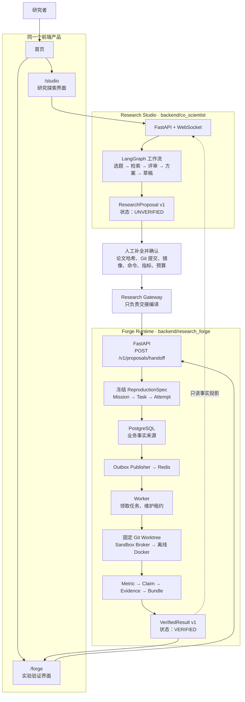

# 项目功能架构总览

> 适用分支：`feat/studio-forge-handoff`
> 一句话：这是**一个产品、两个独立系统、一次受控交接**。Research Studio 负责探索，Forge Runtime 负责验证。

## 先看结论

两个项目已经连成一个完整产品流程，但没有被硬合并成同一套后端。

- **Research Studio**（原 `AI Co-Scientist`）负责“想”：提出课题、检索论文、讨论方案、生成文章草稿。
- **Forge Runtime**（`Research Forge`）负责“验”：在固定代码和固定环境里执行实验，保存证据并生成可复现 Bundle。
- 中间必须经过**人工确认**；Studio 的建议永远是 `UNVERIFIED`（未验证），不能直接让 Agent 执行。

## 一张总图

## 用户实际会经历什么

1. 在 **Studio** 输入一个研究问题，例如“RAG 是否能降低幻觉”。
2. Studio 使用多 Agent 工作流，返回候选课题、论文、研究空白、实验建议和论文草稿。
3. Studio 导出 `ResearchProposal v1`。它明确写着：**未验证**。
4. 你在 Forge 页面粘贴 Proposal，并手动确认所有实验条件：论文文件哈希、代码仓库与 commit、Docker 镜像、运行命令、评价指标、预算等。
5. Gateway 把你确认的数据编译为 `ReproductionSpec v1`；它不会擅自采用 Studio 推荐的命令、哈希或预算。
6. Forge 创建 Mission，在固定 Git worktree 和离线 Docker 沙箱中执行。
7. 只有指标、证据、Bundle 都齐全时，Forge 才产生 `VerifiedResult v1`。

当前是**半自动交接**：Studio API 能导出 Proposal，Forge 页面提供“粘贴 Proposal + 填写确认信息”的表单；还不是从 Studio 一键自动跳到 Forge。

## Research Studio：负责“想”

| 功能 | 作用 | 主要产出 | 核心技术 |
| --- | --- | --- | --- |
| M0 选题发现 | 给模糊方向生成候选课题 | `TopicCard` | LLM、结构化 JSON 输出 |
| M1 问题精炼 | 把问题变得可研究 | PICO、研究约束 | LLM Prompt |
| M2 检索 | 找真实论文并排序 | 论文列表、引用线索 | arXiv、OpenAlex、Semantic Scholar、RRF 融合排序、异步请求 |
| M2.5 证据状态 | 标记全文/摘要/受限等可访问性 | 证据等级 | 规则解析 |
| M3 知识图谱 | 提取实体关系、找研究空白 | `GapCard` | LLM 信息抽取、NetworkX |
| M4 圆桌评审 | 多个评审角色审查方案 | `DecisionCard` | Orchestrator–Subagent、多 Agent 并发 |
| M5/M5.5 实验设计与门禁 | 设计实验并判断是否值得继续 | 实验计划、回退建议 | LLM + 规则门禁 |
| M6 代码建议 | 生成验证代码 | 代码与运行建议 | LLM；默认仅生成，不必执行 |
| M7 文章草稿 | 将材料写成论文草稿 | `main.tex`、`refs.bib` | 多 Agent 并行写作、Claude 总编辑、LaTeX |
| M8 分叉回放 | 比较多个研究方向 | Fork、分支结果 | SQLite 状态记录 |

Studio 的核心是 **LangGraph + `ResearchState`**：每个模块只读写共享状态中的一个部分。它适合探索和生成，但它的结论、文章、代码建议都不是实验事实。

## Forge Runtime：负责“验”

| 功能 | 作用 | 为什么需要它 |
| --- | --- | --- |
| 冻结 `ReproductionSpec` | 固定代码版本、镜像、命令和指标 | 防止“同一实验说不清究竟怎么跑的” |
| PostgreSQL | 保存 Mission、Task、Attempt、审批、审计记录 | 数据库是唯一业务事实来源 |
| Outbox + Redis | 可靠投递异步任务 | 防止数据库写成功但 Worker 没收到任务 |
| Lease（租约） | Worker 定期续租并领取任务 | 防止两个 Worker 同时重复跑同一实验 |
| Git Worktree | 从固定 commit 建立独立工作区 | 防止实验污染原代码或使用漂移版本 |
| Sandbox Broker | 唯一可接触 Docker 的进程 | Worker 不能直接拥有 Docker 权限 |
| 离线 Docker | `--network none` 执行实验 | 防止运行期间偷偷联网改变结果或泄露数据 |
| CAS 产物库 | 用 SHA-256 保存日志、指标和 Bundle | 防止产物被替换后仍被当作原结果 |
| Evidence Gate | 将指标绑定到 commit、环境和数据 | 没有证据闭环，就不能标记成功 |

Forge 当前的重点是“基线复现”。它不会让 Studio 的 LLM 直接操作数据库、Git 或 Docker；这正是系统可信的关键。

## 两边如何连接，又如何隔离

| 交接对象 | 方向 | 含义 | 是否可信 |
| --- | --- | --- | --- |
| `ResearchProposal v1` | Studio → Forge | 研究想法、论文线索、实验建议 | 否，固定为 `UNVERIFIED` |
| `ProposalCompletion v1` | 人 → Forge | 人工确认的执行前提 | 需要 Forge 再校验 |
| `ReproductionSpec v1` | Gateway → Forge | 可执行的冻结任务规格 | 需通过 Schema 和前置条件校验 |
| `VerifiedResult v1` | Forge → Studio/前端 | 已完成任务的指标与 Bundle 事实 | 是，但仅在证据闭环后 |

**不能共享的东西：**

- Studio 不能读取或修改 Forge 的 PostgreSQL 业务状态。
- Forge 不能导入 Studio 的 LangGraph、`ResearchState` 或业务模块。
- Gateway 只处理 JSON 合约，不能替你选择 commit、Docker 镜像、运行命令、指标或预算。
- Studio 的“文章写得很像论文”不能替代 Forge 的实验验证。

## 技术清单：审核时可直接对照

| 技术 | 用在哪里 | 当前定位 |
| --- | --- | --- |
| Python、FastAPI、Pydantic | Studio 与 Forge 后端 API | 已接入 |
| Next.js、React、TypeScript、Tailwind | `/studio` 与 `/forge` 前端 | 已接入 |
| LangGraph | Studio 的多步骤 Agent 编排 | 已接入 |
| GPT 兼容接口、Claude 接口 | Studio 的写作、评审、规划 | 已接入；不是 Forge 的可信判断来源 |
| arXiv、OpenAlex、Semantic Scholar | Studio 文献检索 | 已接入 |
| MCP | 将检索源作为标准工具服务 | 可选，默认关闭 |
| SQLite、DiskCache | Studio 的成本记录、缓存、分叉/记忆等 | 已接入 |
| PostgreSQL、Redis | Forge 持久状态与异步 Attempt 投递 | Forge 运行需要 |
| Git Worktree、Docker | Forge 固定版本和隔离执行 | 正式验证需要 Linux/WSL2 环境 |
| CAS、SHA-256 | Forge 产物防篡改与 Bundle | 已接入 |
| Qdrant、Neo4j、LangSmith | Studio 的增强检索/图/追踪能力 | 可选，不是最小运行必需 |

## 审核时不要混淆的 4 件事

1. **Studio 文章 = 草稿，不是验证结果。** M7 生成的是 LaTeX 与 BibTeX 文件。
2. **Studio 的建议 = Proposal，不是可直接执行的任务。** 必须经人工补全。
3. **Forge 的 Mission 运行中 = 还没验证成功。** 只有 Evidence 和 Bundle 齐全才是 `VERIFIED`。
4. **两个系统在同一产品中，但不是同一套代码。** 它们只通过版本化 JSON 合约交接。

## 建议代码阅读顺序

1. `backend/co_scientist/graph.py`：Studio 如何从问题走到草稿。
2. `backend/co_scientist/public_api/export_proposal.py`：如何导出未验证 Proposal。
3. `backend/research_gateway/studio_to_forge.py`：为什么必须人工补全。
4. `backend/research_forge/adapters/inbound/api/app.py`：Proposal 如何创建 Forge Mission。
5. `backend/research_forge/bootstrap/production.py`：Worker、队列、Git、沙箱如何组装。
6. `backend/research_forge/application/use_cases/get_verified_result.py`：什么条件下能返回 VERIFIED。
